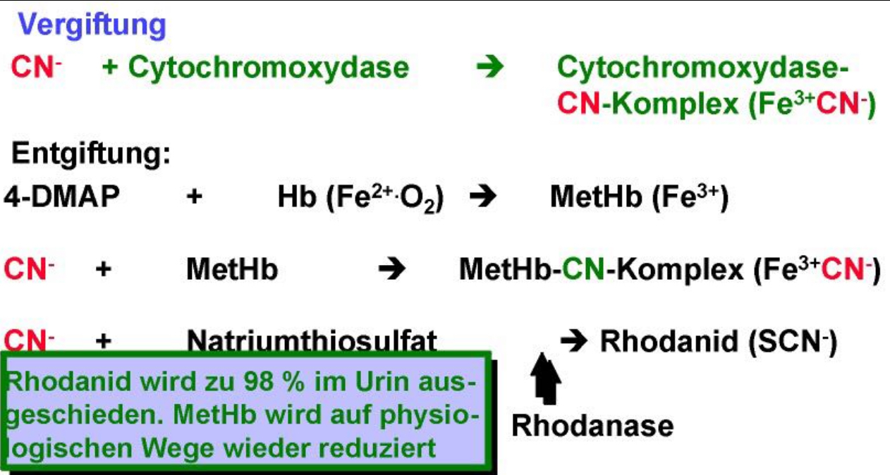

## 4-DMAP
= 4-Dimethylaminophenol  
= Antidot bei Cyanidvergiftungen

---
{width="200"}

---

## 🚨 CAVE / MERKE 💡
- 4-DMAP ist eher veraltet, [Hydroxocobalamin](Hydroxocobalamin.md) ist moderner
- CAVE🚨: bei gleichzeitiger Vergiftung mit CO
	* DMAP = Methämoglobinbilder
	* Bildung von Methämoglobin senkt die Sauerstofftransportkapazität => Gefahr der Hypoxie
	* daher besser [Hydroxocobalamin](Hydroxocobalamin.md) 💊 
	* oder 4-DMAP + [Hydroxocobalamin](Hydroxocobalamin.md) in Kombi (s.u.)

---

## ⚗️ CHEMIE
- Summenformel: C₈H₁₁NO  
- Molekulargewicht: 137,18 g/mol  
- Struktur: Phenolring mit Dimethylamino-Gruppe  
- Darreichung: meist als Hydrochlorid-Salz in Ampullenlösung  

---

## ✨ WIRKUNG
- 4-DMAP oxidiert Hämoglobin (Fe²⁺ → Fe³⁺) und bildet Methämoglobin.  
- Methämoglobin bindet Cyanid-Ionen, wodurch diese nicht mehr die Atmungskette blockieren können.  
- Anschließend wird Natriumthiosulfat verabreicht, um Cyanid in Thiocyanat umzuwandeln und auszuscheiden.  
- HWZ: 2h  

---

## 🚦 INDIKATIONEN
- Schwere Cyanidvergiftung, z. B. durch Blausäure  
- Rauchgasinhalation  
- [Nitrilvergiftungen](Nitrilvergiftungen.md)  
- Kombinationstherapie mit [Hydroxocobalamin](Hydroxocobalamin.md) und Natriumthiosulfat empfohlen  

---

## 💊 DOSIERUNG
- 3–4 mg/kg  
	→ bei 75 kg also 225–300 mg  
	→ 1 Amp. = 5 ml = 250 mg  
- also initial 1 Amp. 😁  

---

## ❌ KONTRAINDIKATIONEN
- gleichzeitige Vergiftung mit CO  
	→ 4-DMAP = Methämoglobinbilder  
	→ also besser [Hydroxocobalamin](Hydroxocobalamin.md) 💡  
- [Asthma Bronchiale](Asthma%20Bronchiale.md)  
- Säuglinge (verminderte Methämoglobin-Reduktase)  
- G6PD-Mangel  
- Schwangerschaft und Stillzeit  

---

  
🔤 Abkürzungen

  <table>
    <thead>
      <tr>
        <th>Abkürzung</th>
        <th>Bedeutung</th>
      </tr>
    </thead>
    <tbody>
      <tr><td>4-DMAP</td><td>4-Dimethylaminophenol; Antidot bei Cyanidvergiftungen</td></tr>
      <tr><td>Amp.</td><td>Ampulle</td></tr>
      <tr><td>CAVE</td><td>(lat. „Vorsicht!“) – Hinweis auf besondere Gefahren oder wichtige Merkpunkte</td></tr>
      <tr><td>CO</td><td>Kohlenmonoxid</td></tr>
      <tr><td>DMAP</td><td>Dimethylaminophenol (Methämoglobinbildner)</td></tr>
      <tr><td>G6PD</td><td>Glucose-6-Phosphat-Dehydrogenase</td></tr>
      <tr><td>HWZ</td><td>Halbwertszeit</td></tr>
      <tr><td>NO</td><td>Stickstoffmonoxid (chemisches Symbol, hier Bestandteil der Summenformel)</td></tr>
    </tbody>
  </table>

  
📚 Quellen

  <ul>
    <li>notfallmedizinapp.com (2017)</li>
    <li>ITS Kurs, KNN, 2018</li>
    <li>DocCheck Flexikon – 4-Dimethylaminophenol. <a href="https://flexikon.doccheck.com/de/4-Dimethylaminophenol">Link</a></li>
    <li>Dr. Franz Köhler Chemie GmbH – Fachinformation zu 4-DMAP. <a href="https://www.koehler-chemie.de/wp-content/uploads/2018/03/GIFI_4-DMAP_2017.pdf">PDF</a></li>
    <li>Shop Apotheke – Produktinfo zu 4-DMAP® Antidotlösung. <a href="https://www.shop-apotheke.com/arzneimittel/2057607/4-dmap-antidotloesung.htm">Link</a></li>
  </ul>

  
🏷️ Tags

  
#4-DMAP #Cyanid #Blausäure #Vergiftung #Antidot #Intoxikation #Hydroxocobalmin #Methämoglobin #Medikament

