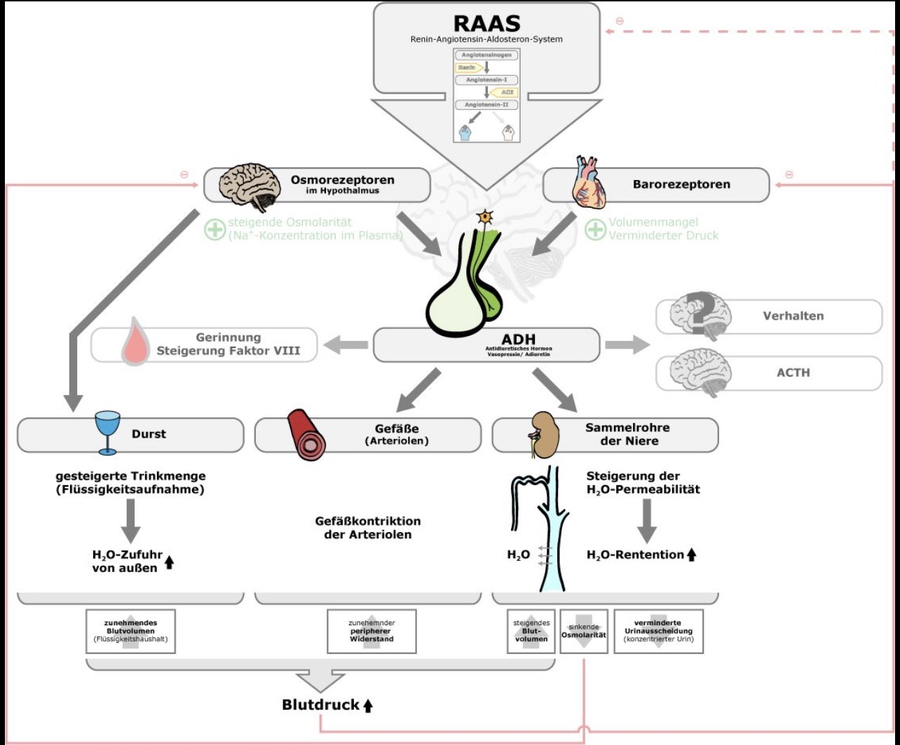

## ADH
= Antidiuretisches Hormon  
= Vasopressin ≠ [Desmopressin](Desmopressin.md)

(Bild 1)

---

## 💬 KURZ
- ADH ist ein im Hypothalamus gebildetes und im Hypophysenhinterlappen gespeichertes Hormon  
- Es reguliert den Wasserhaushalt, den Gefäßtonus und beeinflusst die Hämostase  
- Das synthetische Analogon **[Desmopressin](Desmopressin.md)** wirkt länger und selektiv über V2-Rezeptoren  

---

## 🚨 CAVE / MERKE 💡
- **ADH-Überschuss**  
	→ [Hyponatriämie](Hyponatriämie.md) (z. B. SIADH)  
- **ADH-Mangel**  
	→ Diabetes insipidus  
- [Desmopressin](Desmopressin.md) darf **nicht** bei Herzinsuffizienz oder [Hyponatriämie](Hyponatriämie.md) gegeben werden  

---

## ⚙️ PATHOPHYSIOLOGIE
- **Osmorezeptoren** im Hypothalamus messen Plasmaosmolalität  
- **Volumenrezeptoren** (Vorhöfe, Barorezeptoren) reagieren auf Blutvolumen/-druck  
- Bei ↑ Osmolalität oder ↓ Volumen  
	→ ADH-Ausschüttung  

---

## ✨ WIRKUNG
### 1. V1-Rezeptoren
- Vasokonstriktion  
	→ Blutdrucksteigerung  

### 2. V2-Rezeptoren
- Bindung an V2-Rezeptoren im Sammelrohr der Niere  
	→ Einbau von Aquaporin-2-Kanälen  
	→ **Wasserrückresorption** ↑  
	→ Blutvolumen ↑ (& konzentrierter Urin)  
	→ RR-Anstieg  

### 3. Hämostase
- Freisetzung von von-Willebrand-Faktor (vWF)  
- Steigerung von Faktor VIII  
- Aktivierung thrombozytärer Adhäsionsmoleküle  
- Klinisch: Verbesserung der primären und sekundären Hämostase  

---

## 📌 KLINISCHE HINWEISE
- **Mangel**:  
	→ Diabetes insipidus (Polyurie, Polydipsie)  
- **Überschuss**:  
	→ SIADH → [Hyponatriämie](Hyponatriämie.md), neurologische Symptome  

---

## 🔎 NORMWERTE
- **Plasmaosmolalität**: ca. 280–300 mosmol/kg  
- **Natrium**: 135–145 mmol/l  
- **Urinosmolalität**: variabel, abhängig von ADH-Wirkung  

---

## ⚗️ CHEMIE
- Peptidhormon (Nonapeptid)  
- Synthese: Nucleus supraopticus & paraventricularis (Hypothalamus)  
- Speicherung & Freisetzung: Neurohypophyse  

---

  
🔤 Abkürzungen

  <table>
    <thead>
      <tr>
        <th>Abkürzung</th>
        <th>Bedeutung</th>
      </tr>
    </thead>
    <tbody>
      <tr><td>ADH</td><td>Antidiuretisches Hormon</td></tr>
      <tr><td>SIADH</td><td>Syndrom der inadäquaten ADH-Sekretion</td></tr>
      <tr><td>vWF</td><td>von-Willebrand-Faktor</td></tr>
    </tbody>
  </table>

  
📚 Quellen

  <ul>
    <li>Robertson GL. Antidiuretic hormone. <i>N Engl J Med</i>. 1984;310(9):562–573.</li>
    <li>Verbalis JG. Disorders of water balance. In: Jameson JL, Fauci AS, Kasper DL, et al. <i>Harrison’s Principles of Internal Medicine</i>. 21st ed. McGraw-Hill; 2022.</li>
    <li>Schrier RW. Vasopressin and aquaporin 2 in clinical disorders of water homeostasis. <i>Semin Nephrol</i>. 2008;28(3):289–296.</li>
    <li>Mannucci PM. Desmopressin (DDAVP) in the treatment of bleeding disorders: the first 20 years. <i>Blood</i>. 1997;90(7):2515–2521.</li>
    <li>Schwarz C, Lindner G, Windpessl M, Knechtelsdorfer M, Saemann MD. Konsensusempfehlungen zur Diagnose und Therapie der Hyponatriämie der Österreichischen Gesellschaft für Nephrologie 2024. <i>Wien Klin Wochenschr</i>. 2024;136(13–14):557–574. <a href="https://pmc.ncbi.nlm.nih.gov/articles/PMC10904443/">Link</a></li>
  </ul>

  
🏷️ Tags

  
#ADH #Vasopressin #Desmopressin #DiabetesInsipidus #SIADH #Endokrinologie #Nephrologie #Gerinnung

