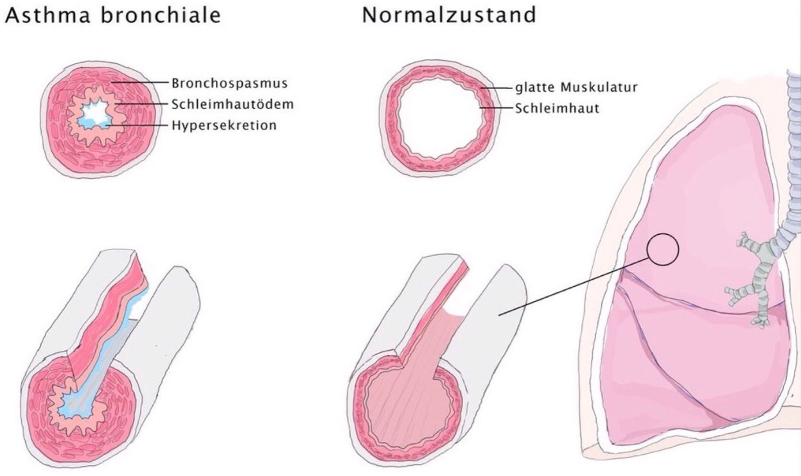

# Asthma Bronchiale
= chronisch-entzündliche Erkrankung der Atemwege
= anfallsartige, reversible **Obstruktion** der Bronchien durch Hyperreagibilität

---
https://www.doctopia.de/wissen/asthma-karteikarten-100.html
---

## 🚨 CAVE / MERKE 💡
- Trigger wie Intubation, Medikamente oder Stress können Asthmaanfälle auslösen
- Häufig! Ca. 330 Millionen weltweit  
- Typisch: nächtliche Anfälle  
- 5 % der Erwachsenen  
- 10 % der Kinder  

---

## 🩺 Anästhesiologische Relevanz

#### Präoperativ
- Anamnese: Schweregrad, letzte Exazerbation, Medikation  
- Lungenfunktion prüfen  
- Optimierung: Steroide, Bronchodilatatoren, Atemphysiotherapie  

#### Intraoperativ
- Trigger vermeiden: Intubationsreiz, kalte Gase, Histaminliberatoren  
- Narkosemittel:  
  - Propofol (bronchodilatierend)  
  - Ketamin (bronchodilatierend, gut bei Status asthmaticus)  
  - Sevofluran (bronchodilatierend)  
- Atemweg: Larynxmaske bevorzugt, Intubation mit Vorsicht  
- Beatmung: verlängerte Exspiration, permissive Hyperkapnie  

#### Postoperativ
- Monitoring: SpO₂, Atemfrequenz, Auskultation  
- PONV-Prophylaxe  
- Analgesie: regional bevorzugt, Opioide sparsam  

---

## ❓ Ursachen

#### 1. Allergisch (= extrinsisches Asthma)
- Größter Risikofaktor: Atopie  
- Pollen, Gräser, Tierhaare, Schimmel  
- Rauchen❗️  
- Berufskrankheiten (z. B. Bäckerasthma durch Mehlstaub)  

#### 2. Nicht-allergisch (= intrinsisches Asthma)
- ASS / NSAR  
- Chemisch-toxisch: Rauchen, Ozon, Schwefel  
- Infektbedingt  
- Kalte Luft  
- Belastungsasthma  

---

## ⚙️ Pathophysiologie
- Bronchiale Hyperreagibilität mit Verdickung der Basalmembran  
- Bronchiale Obstruktion durch  
  → Bronchospasmus  
  → Schleimhautödem  
  → Becherzellhyperplasie  
  → Schleimproduktion ↑  

{ width="200"}  
*(Bild 1)*

---

## 🚑 Klinik
- Leitsymptome:  
  1. Anfallsartige Dyspnoe  
  2. Exspiratorischer Stridor („Luft geht nicht raus“)  
- Angst zu ersticken  
- Husten  
- Bei Chronifizierung: Emphysem & Infektneigung  

---

## 🩺 Diagnostik

#### 1. Anamnese 🗣️
| Asthma                     | COPD             |
| -------------------------- | ---------------- |
| häufig Raucher 🚬 (40 %)   | bei COPD auch✅   |
| variabler Verlauf          | bei COPD kaum❌   |
| häufig nächtliche Anfälle  | bei COPD selten❌ |
| gute Wirkung von Steroiden | bei COPD selten❌ |

#### 2. Untersuchung 🔍
- **Perkussion**: hypersonorer Klopfschall, tiefstehendes Zwerchfell  
- **Auskultation**: „silent lung“, exspiratorisches Giemen, Tachypnoe  

{ width="200"}  
*(Bild 2)*

#### 3. Labor 🧪
- Allergisch: IgE ↑, Eosinophilie  
- Infektbedingt: Entzündungsparameter ↑  
- BGA:  
	→ resp. Insuffizienz  
	→ nur pO₂↓ = hypoxämische resp. Insuffizienz  
	→ pO₂↓ & pCO₂↑ = hyperkapnische resp. Insuffizienz    
#### 4. Lungenfunktion 🫁
###### a) Obstruktion & Restriktion
- Obstruktiv: FEV₁ ↓, Tiffeneau-Index < 70 %  
- Restriktiv: FVC ↓, Tiffeneau normal/↑  

  

    ℹ️ Obstruktion vs. Restriktion – Details
  

  

    <!-- Stil (leicht, neutral, obsidian-freundlich) -->
    

    

      

        Obstruktion vs. Restriktion
        Spirometrie
      

      <table class="lf-table">
        <thead>
          <tr>
            <th>Merkmal</th>
            <th>Obstruktive Ventilationsstörung</th>
            <th>Restriktive Ventilationsstörung</th>
          </tr>
        </thead>
        <tbody>
          <tr>
            <td><strong>Definition</strong></td>
            <td>Erhöhter Strömungswiderstand in den Atemwegen</td>
            <td>Verminderte Dehnbarkeit oder reduzierte Lungenvolumina</td>
          </tr>
          <tr>
            <td><strong>FEV₁</strong></td>
            <td>↓</td>
            <td>↓</td>
          </tr>
          <tr>
            <td><strong>FVC</strong></td>
            <td>normal oder leicht ↓</td>
            <td>↓</td>
          </tr>
          <tr>
            <td><strong>Tiffeneau-Index</strong></td>
            <td>&lt; 70 % (nach GOLD)</td>
            <td>Normal oder ↑</td>
          </tr>
          <tr>
            <td><strong>Pathophysiologie</strong></td>
            <td>Verengung/Obstruktion der Atemwege</td>
            <td>Einschränkung der Lungenexpansion</td>
          </tr>
          <tr>
            <td><strong>Typische Ursachen</strong></td>
            <td>COPD, Asthma bronchiale, chronische Bronchitis, Emphysem</td>
            <td>Lungenfibrose, Pleuraerguss, Skoliose, Adipositas</td>
          </tr>
        </tbody>
      </table>

      

        

          
          
(Bild 3)

        

      

      

        Hinweis: Interpretation stets im klinischen Kontext (Symptome, Reversibilitätstest, Verlauf).
      

    

  

###### b) Spirometrie
- Residualvolumen ↑  
- FEV₁ ↓  
- Schweregrade nach % des Sollwerts:
	- 80-60% = leichtgradig
	- 60-40% = mittelgradig
	- <40% = hochgradig

  

    ℹ️ Spirometrie – Details
  

  

    

    

      
Spirometrie – Messwerte im Überblick

      <table class="spirometrie-table">
        <thead>
          <tr>
            <th>Spirometrie</th>
            <th></th>
            <th></th>
          </tr>
        </thead>
        <tbody>
          <tr>
            <td><strong>TLC</strong></td>
            <td>=</td>
            <td></td>
          </tr>
          <tr>
            <td><strong>VC</strong></td>
            <td>↓</td>
            <td></td>
          </tr>
          <tr>
            <td><strong>Residualvolumen</strong></td>
            <td>↑</td>
            <td></td>
          </tr>
          <tr>
            <td><strong>FEV₁</strong></td>
            <td>↓</td>
            <td>&lt;80 % des Sollwertes*</td>
          </tr>
          <tr>
            <td><strong>Tiffeneau Index</strong></td>
            <td>↓</td>
            <td>&lt;70 % des Sollwertes</td>
          </tr>
        </tbody>
      </table>

      

        → Test mindestens 3x wiederholen 
        → Der Unterschied zwischen den zwei höchsten Werten muss unter 5 % liegen
      

    

  

###### c) Tests
- Reversibilitätstest:  
	- SABA → FEV₁ ↑ = Asthma  
- Metacholin-Test:  
	- Resistance ↑, FEV₁ ↓  

  

    ℹ️ Bronchiale Provokationstests – Reversibilität & Metacholin
  

  

    

    

      
Diagnostische Aussagekraft bronchialer Provokationstests

      

        <h4>🔄 Reversibilitätstest</h4>
        <ul class="provokation-list">
          <li>Gabe eines kurzwirksamen β₂-Mimetikums (SABA), z. B. Salbutamol</li>
          <li>Messung der FEV₁ vor und nach Inhalation</li>
          <li><strong>Komplette Reversibilität</strong> der Obstruktion → FEV₁ ↑ ≥ 12 % und ≥ 200 ml</li>
          <li>→ <strong>Asthma bronchiale</strong> bestätigt</li>
          <li>→ <strong>Keine Reversibilität</strong> spricht eher für COPD</li>
        </ul>
      

      

        <h4>🧬 Metacholin-Provokationstest</h4>
        <ul class="provokation-list">
          <li>Inhalative Gabe von Metacholin (Parasympathomimetikum)</li>
          <li>Induziert bronchiale Hyperreagibilität</li>
          <li>→ FEV₁ sinkt signifikant (> 20 %)</li>
          <li>→ Resistance ↑</li>
          <li>→ Positiver Test spricht für Asthma bronchiale</li>
        </ul>
      

      

        Hinweis: Beide Tests sollten unter kontrollierten Bedingungen erfolgen. Der Metacholin-Test ist besonders sensitiv, aber nicht spezifisch.
      

    

  

{ width="200"}  
*(Bild 4)*

#### 5. Röntgen 🩻 
- Zeichen der Überblähung: 
	- Fassthorax, tiefes Zwerchfell, verbreiterte Intercostalräume *(Bild 2)*
- DD: 
	- COPD, Asthma cardiale, Lungenembolie, Pneumothorax  

#### 6. Hauttests 🖐️
- Prick-Test: Allergenexposition auf der Haut  

---

## 🏥 Therapie

### 1. Notfalltherapie 🆘
- **SABA** inhalativ: Salbutamol, Fenoterol  
- **Glukokortikoide i.v.**: Prednisolon  
- **Ipratropiumbromid**: Atrovent  
- **Magnesium i.v.** bei schwerem Anfall  
- Sauerstoff, Oberkörper hoch, Monitoring  
- ❌ Keine β-Blocker  

  

    💊 Dosierungen
  

  

    

    

      <table class="notfall-table">
        <thead>
          <tr>
            <th>Medikament</th>
            <th>Applikation</th>
            <th>Dosierung</th>
          </tr>
        </thead>
        <tbody>
          <tr>
            <td><strong>Salbutamol</strong></td>
            <td>inhalativ</td>
            <td>2–4 Hübe (100–200 μg), ggf. alle 20 Min</td>
          </tr>
          <tr>
            <td><strong>Fenoterol</strong></td>
            <td>inhalativ</td>
            <td>2–4 Hübe (100–200 μg), ggf. alle 20 Min</td>
          </tr>
          <tr>
            <td><strong>Reproterol</strong></td>
            <td>i.v.</td>
            <td>1 μg/kg KG langsam über 5 Min</td>
          </tr>
          <tr>
            <td><strong>Terbutalin</strong></td>
            <td>s.c.</td>
            <td>5 μg/kg KG</td>
          </tr>
          <tr>
            <td><strong>Prednisolon</strong></td>
            <td>i.v.</td>
            <td>250 mg (Erwachsene) 2 mg/kg KG (Kinder)</td>
          </tr>
          <tr>
            <td><strong>Ipratropiumbromid (Atrovent)</strong></td>
            <td>inhalativ</td>
            <td>250–500 μg (1–2 Ampullen), bis zu 3–4×/Tag</td>
          </tr>
          <tr>
            <td><strong>Magnesiumsulfat</strong></td>
            <td>i.v.</td>
            <td>2 g über 20 Min (Erwachsene) 25–75 mg/kg KG (Kinder)</td>
          </tr>
          <tr>
            <td><strong>Morphin</strong></td>
            <td>i.v.</td>
            <td>nur bei schwerer Dyspnoe mit Angst – Einzelfallentscheidung</td>
          </tr>
        </tbody>
      </table>

      

        <strong>Hinweis:</strong> Theophyllin ist laut GINA 2023 und NVL Asthma 2024 nicht mehr empfohlen zur Notfalltherapie – geringe Wirksamkeit, hohe Nebenwirkungsrate. Dosierungen sind Richtwerte und müssen individuell angepasst werden. Monitoring & ärztliche Erfahrung sind essenziell.
      

    

  

### 2. Dauertherapie 💉
- **Nicht-medikamentös**: Sport, Atemphysiotherapie, Rauchstopp, Gewichtsreduktion, Schulungen  
- **Medikamentös (Stufenschema GINA 2023):**  
  - Stufe 1: ICS/Formoterol bei Bedarf  
  - Stufe 2: ICS niedrigdosiert  
  - Stufe 3: ICS + LABA  
  - Stufe 4: ICS mittlere Dosis + LABA  
  - Stufe 5: ICS hochdosiert + Biologika (Omalizumab, Mepolizumab, Reslizumab, Benralizumab)  

  

    💊 Dosierungen (GINA 2025 / NVL 2024)
  

  

    

    

      <table class="dauer-table">
        <thead>
          <tr>
            <th>Stufe</th>
            <th>Medikamente</th>
            <th>Dosierung</th>
          </tr>
        </thead>
        <tbody>
          <tr>
            <td><strong>Stufe 1</strong></td>
            <td>ICS/Formoterol bei Bedarf</td>
            <td>Formoterol 6 μg + Budesonid 100 μg pro Hub, 1–2 Hübe bei Symptomen</td>
          </tr>
          <tr>
            <td><strong>Stufe 2</strong></td>
            <td>ICS niedrigdosiert</td>
            <td>Budesonid 200–400 μg/Tag oder Beclometason 250–500 μg/Tag</td>
          </tr>
          <tr>
            <td><strong>Stufe 3</strong></td>
            <td>ICS + LABA</td>
            <td>Budesonid/Formoterol 2× täglich, z. B. 200/6 μg pro Dosis</td>
          </tr>
          <tr>
            <td><strong>Stufe 4</strong></td>
            <td>ICS mittlere Dosis + LABA</td>
            <td>Budesonid 400–800 μg/Tag + Formoterol/Salmeterol</td>
          </tr>
          <tr>
            <td><strong>Stufe 5</strong></td>
            <td>ICS hochdosiert + Biologika</td>
            <td>Budesonid ≥ 800 μg/Tag + Anti-IgE (Omalizumab) oder Anti-IL-5 (Mepolizumab, Reslizumab, Benralizumab)</td>
          </tr>
        </tbody>
      </table>

      

        <strong>Hinweis:</strong> Theophyllin ist nicht mehr empfohlen. ICS/Formoterol als Bedarfsmedikation ist nun auch in Stufe 1 zugelassen. Biologika werden bei schwerem Asthma mit Typ-2-Inflammation eingesetzt. Dosisanpassung erfolgt individuell nach Symptomkontrolle und Exazerbationsrisiko.
      

    

  

---

  

    🔤 Abkürzungen
  

  

    

    

      <table class="abbr-table">
        <thead>
          <tr>
            <th>Abkürzung</th>
            <th>Bedeutung</th>
          </tr>
        </thead>
        <tbody>
          <tr><td>ASS</td><td>Acetylsalicylsäure</td></tr>
          <tr><td>COPD</td><td>chronic obstructive pulmonary disease</td></tr>
          <tr><td>EGPA</td><td>Eosinophile Granulomatose mit Polyangiitis</td></tr>
          <tr><td>ICS</td><td>inhalative CorticoSteroide</td></tr>
          <tr><td>LABA</td><td>long acting beta agonist</td></tr>
          <tr><td>LAMA</td><td>long acting muscarinic antagonist</td></tr>
          <tr><td>LMA</td><td>Larynxmaske</td></tr>
          <tr><td>LTA</td><td>Larynx-Tubus-Alternative</td></tr>
          <tr><td>MAC</td><td>Minimum Alveolar Concentration</td></tr>
          <tr><td>NSAR</td><td>nicht steroidale Antirheumatika</td></tr>
          <tr><td>PONV</td><td>postoperative nausea and vomiting</td></tr>
          <tr><td>RF</td><td>Risikofaktor(en)</td></tr>
          <tr><td>SABA</td><td>short acting beta agonist</td></tr>
          <tr><td>GINA</td><td>Global Initiative for Asthma</td></tr>
        </tbody>
      </table>
    

  

  

    📚 Quellen
  

  

    

    

      <ol class="quellen-list">
        <li>miamed 2014</li>
        <li>Fachinformationen</li>
        <li>Coliquio: Erfolgsfaktoren der Asthmatherapie</li>
        <li>notfallmedizinapp.com (10/17)</li>
        <li>A&I 02/2018</li>
        <li>cme-kurs.de – „Leitliniengerechte Diagnose und Therapie von Asthma“ (Update 2017)</li>
        <li>cme-kurs.de – „Schweres Asthma“ (Update 2017)</li>
        <li>Deutsches Ärzteblatt, 25/2020, S. 434ff.</li>
        <li>SpringerMedizin: <em>Anästhesie bei Asthma bronchiale</em></li>
        <li>AI Online: <em>Asthma in der perioperativen Phase</em></li>
        <li>NYSORA: <em>Respiratory diseases and anesthesia</em></li>
        <li>GINA 2023 – Global Initiative for Asthma, Pocket Guide</li>
      </ol>
    

  

  

    🏷️ Tags
  

  

    

    

      #Lungenerkrankung
      #Notfall
      #Dyspnoe
      #Anästhesie
      #Perioperativ
      #Atemwegssicherung
    

  

