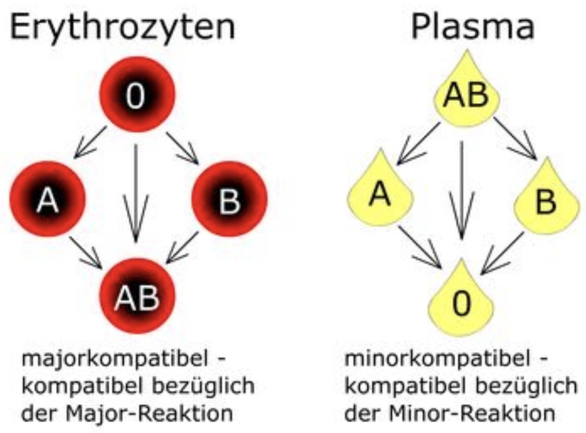

# Bluttransfusion

---
## 🚦 INDIKATIONEN

#### Indikationen für EKs

| Hb-Wert | Indikation | Bemerkung |
|---------|------------|-----------|
| <6 g/dl | immer | klare Transfusionsindikation |
| 6–8 g/dl | erwägen | abhängig von klinischem Zustand |
| >8 g/dl | nur bei akuter Blutung | keine Routinegabe |
| >10 g/dl | keine Transfusion | außer bei massiver Blutung |

➡️ **Zusatz:**  
- Bei **kardiovaskulären Vorerkrankung**: Trigger **7–8 g/dl**  
- Bei **Sepsis**: Trigger **7 g/dl** 

#### Indikationen für TKs

| Thrombozytenzahl | Indikation                                                     | Bemerkung           |
| ---------------- | -------------------------------------------------------------- | ------------------- |
| <10.000/nl       | immer                                                          | absolute Indikation |
| <20.000/nl       | bei Infekt, Fieber, Blutung, Gerinnungsstörung, raschem Abfall | relative Indikation |
| <80.000/nl       | bei neurochirurgischen Eingriffen                              | prophylaktisch      |
| <100.000/nl      | bei Polytrauma                                                 | prophylaktisch      |
| >50.000/nl       | bei aktiver Blutung oder DIC                                   | Zielwert            |

➡️ **Zusatz:**  
- TKs müssen **AB0-kompatibel** transfundiert werden — genau wie EKs.  
- Zusätzlich sollte bei **RhD-negativen Frauen im gebärfähigen Alter** möglichst **RhD-negativ** transfundiert werden.

---
## 🗣️ RISIKOAUFKLÄRUNG  
- Allergien  
- [TACO](TACO.md)  
- [FNHTR](FNHTR.md)  
- [TRALI](TRALI.md)  
- [DHTR](DHTR.md)  
- [AHTR](AHTR.md)  
- Infektionskrankheiten: HIV, Hepatitis  
- Erhöhtes Risiko für:  
	- Infektionen  
	- Malignome  
	- ACS  
	- Lungenödem  
	- Mortalität  
- **Eisenüberladung** bei chronischer Transfusion (Hämatologie)

{width="200"}

🔤 Abkürzungen (aus der Grafik)

<table>
<thead>
<tr><th>Abkürzung</th><th>Bedeutung</th></tr>
</thead>
<tbody>
<tr><td>AHTR</td><td>Acute Hemolytic Transfusion Reaction</td></tr>
<tr><td>DHTR</td><td>Delayed Hemolytic Transfusion Reaction</td></tr>
<tr><td>FNHTR</td><td>Febrile Non‑Hemolytic Transfusion Reaction</td></tr>
<tr><td>HBV</td><td>Hepatitis B Virus</td></tr>
<tr><td>HCV</td><td>Hepatitis C Virus</td></tr>
<tr><td>HIV</td><td>Human Immunodeficiency Virus</td></tr>
<tr><td>TACO</td><td>Transfusion Associated Circulatory Overload</td></tr>
<tr><td>TRALI</td><td>Transfusion Related Acute Lung Injury</td></tr>
</tbody>
</table>

---
## 🌀 TRANSFUSIONSREAKTION

#### 1. Klinisch 🚑   
- Fieber (häufigstes Symptom)  
- Rückenschmerzen (klassisch bei akuter Hämolyse)  
- Unruhe, Übelkeit/Erbrechen 🤮  
- Kaltschweißigkeit, thorakales Engegefühl  
- Flush, Frösteln  
- Blässe, Urtikaria  
- Bronchospasmus, Schock  
- Akutes Nierenversagen  
- Perioperativ: DIC  

#### 2. Symptome in Narkose 💤  
- Hypotonie  
- Tachykardie  
- Roter Urin  
- Exanthem  
- Blutungsneigung  
- Hypoxie (z. B. bei [TRALI](TRALI.md))  
- Anstieg der Beatmungsdrücke ([TRALI](TRALI.md))

#### 3. Laborchemisch 🧪  
- Haptoglobin <100 mg/dl  
- LDH >240 U/l  
- Indirektes Bilirubin ↑  
- Kreatinin ↑  
- Hyperkaliämie möglich  
- Freies Hämoglobin ↑  
- Direkter Coombs-Test positiv  
- D-Dimere ↑ (bei DIC)  
- INR ↑, PTT ↑ (Gerinnungsstörung)  
- Hämoglobinurie (Urinstatus)

---
## 🩺 DIAGNOSTIK
#### 1. Bedsidetest
- wird durch den behandelnden Arzt gemacht  
	→ kann delegiert werden  
	→ verantwortlich ist immer der Arzt 💡  
- immer bettseitig durchführen  
- direkt nach der Blutabnahme  
- unmittelbar vor Transfusion  
- Dokumentation auf Begleitschein und Patientenkurve  

#### 2. Coombs-Test
- wird durch das Labor gemacht  
- **Direkter Coombs-Test**:  
	→ Nachweis von AK auf Erythrozyten  
	→ wichtig bei Transfusionsreaktion  
- **Indirekter Coombs-Test (AK-Suchtest)**:  
	→ Nachweis von AK im Serum  
	→ Routine vor einer Transfusion  

---
## 🏥 THERAPIE 
#### 1. Allgemein 💬
- Transfusion sofort stoppen  
- Weitere Transfusion nur im vitalen Notfall  
- Zugang belassen  
- Blutabnahme: BB, Gerinnung, Kreatinin  
- Kontrolle von Identität und Begleitschein  
- An Blutbank senden:  
	- Empfängerblut (EDTA nach Transfusion)  
	- Konservenrest  
	- Begleitschein  
	- Basismeldebogen „Transfusionsreaktion“  
	- Anforderungsbeleg mit Diagnose „Transfusionsreaktion“  
- Blutkulturen abnehmen  
- Rücksprache mit Blutbank-Dienstarzt (Blutspendearzt: 0800/1222888)  

#### 2. Medikamente 💊 
- Schockbehandlung  
- Ggf. forcierte Diurese oder [Dialyse](CiCa-Dialyse.md)  
- *Methylprednisolon* bis 1 g  
- Antihistaminika:  
	- *Fenistil* 4–8 mg  
	- *Ranitidin* 50–100 mg (alternativ *Famotidin* 20 mg)  
- Ggf. *Eculizumab* off-label innerhalb von 2h  

---
## 📜 KOMPATIBILITÄT

| BG Patient | Kompatible FFPs | Kompatible EKs |
|------------|-----------------|----------------|
| 0          | 0, AB, A, B     | 0              |
| A          | A, AB           | A, 0           |
| B          | B, AB           | B, 0           |
| AB         | AB              | AB, A, B, 0    |
{width=“200“}

| Komponente                     | Kompatibilitätsregel              | Begründung                                                                                                                                         |
| ------------------------------ | --------------------------------- | -------------------------------------------------------------------------------------------------------------------------------------------------- |
| EKs                            | **AB0-kompatibel**                | Erythrozyten tragen AB0-Antigene → inkompatible Transfusion führt zu sofortiger Hämolyse                                                           |
| TKs                            | **AB0-kompatibel**                | Thrombozyten exprimieren AB0-Antigene → inkompatible Transfusion führt zu rascher Zerstörung der TKs und immunologischen Reaktionen                |
| [FFPs](Fresh-Frozen-Plasma.md) | **nach Antikörperkompatibilität** | Enthält Antikörper gegen AB0-Antigene → entscheidend ist, dass die Antikörper im Plasma nicht gegen die Erythrozyten des Empfängers gerichtet sind |

➡️ **Merke:**  
- EKs und TKs müssen **wie Zellen** AB0-kompatibel transfundiert werden.  
- [FFPs](Fresh-Frozen-Plasma.md) richten sich nach den **Antikörpern im Plasma**, nicht nach den Antigenen auf Zellen.  

---

🔤 Abkürzungen

<table>
<thead>
<tr><th>Abkürzung</th><th>Bedeutung</th></tr>
</thead>
<tbody>
<tr><td>ACS</td><td>Acute Coronary Syndrome</td></tr>
<tr><td>AK</td><td>Antikörper</td></tr>
<tr><td>AKS</td><td>Antikörpersuchtest</td></tr>
<tr><td>BB</td><td>Blutbild</td></tr>
<tr><td>BK</td><td>Blutkultur</td></tr>
<tr><td>DIC</td><td>Disseminierte intravasale Koagulopathie</td></tr>
<tr><td>DCT</td><td>Direkter Coombs-Test</td></tr>
<tr><td>EK</td><td>Erythrozytenkonzentrat</td></tr>
<tr><td>FFP</td><td>Fresh Frozen Plasma</td></tr>
<tr><td>Hb</td><td>Hämoglobin</td></tr>
<tr><td>HRST</td><td>Herzrhythmusstörungen</td></tr>
<tr><td>LDH</td><td>Laktatdehydrogenase</td></tr>
<tr><td>PBM</td><td>Patient Blood Management</td></tr>
<tr><td>ScvO₂</td><td>Zentrale venöse Sauerstoffsättigung</td></tr>
<tr><td>TK</td><td>Thrombozytenkonzentrat</td></tr>
<tr><td>TACO</td><td>Transfusion Associated Circulatory Overload</td></tr>
<tr><td>TRALI</td><td>Transfusion Related Acute Lung Injury</td></tr>
</tbody>
</table>

📚 Quellen

<ul>
<li>AABB. Red Blood Cell Transfusion: 2023 Clinical Practice Guidelines. <i>JAMA</i>. 2023;330(19):1904–1916.</li>
<li>AABB & ICTMG. Platelet Transfusion: 2025 International Clinical Practice Guidelines. <i>JAMA</i>. 2025;334(7):e7529.</li>
<li>Stanworth SJ, Estcourt LJ, et al. Guidelines for the use of platelet transfusions. <i>Br J Haematol</i>. 2015;170(4):453–523.</li>
<li>Kleinman S, et al. Risks of transfusion-transmitted infections. <i>Blood</i>. 2019;133(17):1854–1864.</li>
<li>Kranke P, et al. Anästhesie Update. 2020.</li>
<li>FoBi KNS. Transfusionsmedizin. 2017.</li>
<li>ITS Kurs KNN. 2018.</li>
</ul>

🏷️ Tags

#Gerinnung #Bluttransfusion #PBM #Anästhesie #Intensivmedizin #Patientensicherheit  

