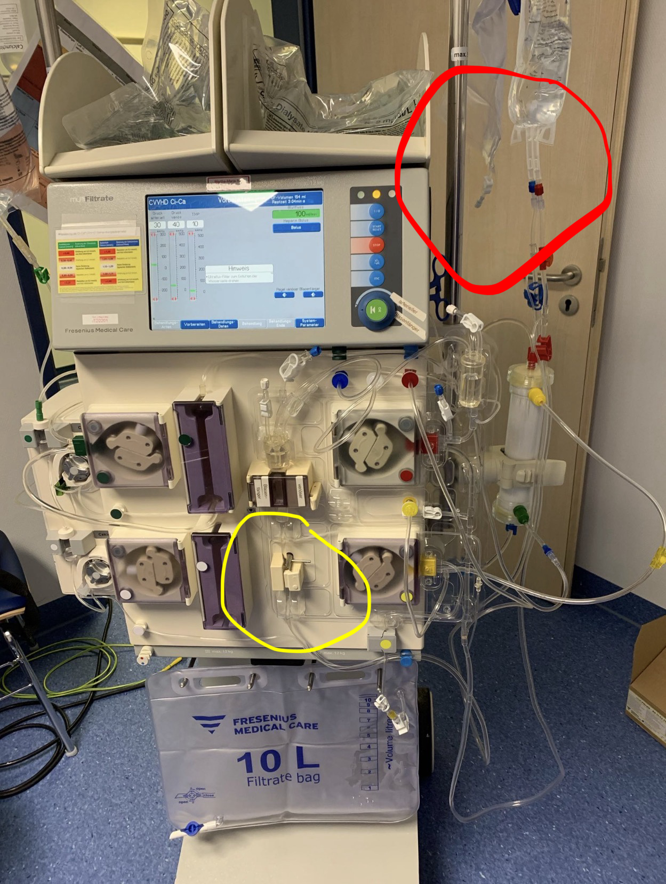
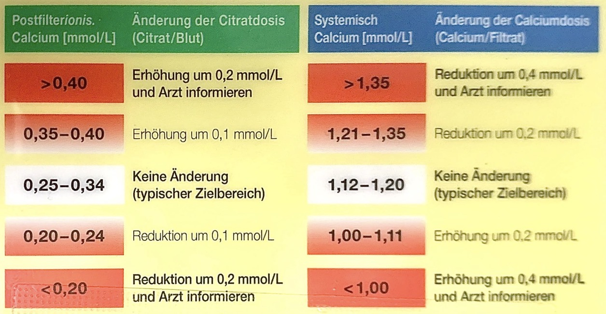

# CiCa-Dialyse  
= Hämodialyse ✅  
≠ Hämofiltration ❌  

---
## ▶️ ANSCHLUSS
- die Pflege baut das Gerät auf  
- rot (CiCa) an rot (Shaldon) anschließen  
	→ CAVE: vorher alle Klemmen schließen, vor allem die extra Klemme am NaCl-Beutel 😉 (siehe Bild 1, oben rechts, roter Kringel)  
- warten bis das Blut durch die CiCa durch läuft, ein optischer Sensor sagt Bescheid (ca. 1-2 min)  
- Dann blau (CiCa) an blau (Shaldon) anschließen  
- Fertig. Dialyse starten.  

{width=“200“}
(Bild 1)  

---
## ⚙️ ANFANGSEINSTELLUNGEN
= sogenanntes *Berliner Protokoll*  
- Dialysat-Fluss: 2000 ml/h  
- Blut-Fluss = 100 ml/h  
	→ Verhältnis = **20 : 1**  
	→ Änderung s. unten „2. Säure-Basen-Haushalt“ (bei Azidose oder Alkalose)  
- Citrat-Fluss: **4,0 ml/h**  
- Calcium-Fluss: **1,7 ml/h**  

---
## 📊 BGA
- Immer **postfilter** und **systemisch**  
- 5 min nach Behandlungsbeginn  
- Danach alle **6–8 h**

{width="200"}
(Bild 2)

---
## 🚨 PROBLEME

#### 1. Niedriger venöser Druck
- Bett hoch pumpen (hilft zu 95%)  
- Grenze von 15 auf **5–10** reduzieren  

#### 2. Säure-Basen-Haushalt
- **Metabolische Alkalose** → Dialysatfluss auf **2400 ml/h** erhöhen  
- **Metabolische Azidose** → Blutfluss auf **120 ml/min** reduzieren  

#### 3. Elektrolytstörungen
- Hypo-/Hyperkaliämie  
- Hypo-/Hypernatriämie  
- Hypophosphatämie  

#### 4. Citratakkumulation
- Ursache: Leberinsuffizienz  
- Erhöhung der Ca²⁺-Substitution nötig  
- Gefahr: **Hypercalziämie**  
- Diagnose: ionisiertes Ca²⁺ ↓, systemisches Ca²⁺ ↑  
- Folge: Abbruch der Citratantikoagulation erwägen  

#### 5. Blutprodukte – geht das?!
| Produkt           | CiCa möglich? |
|-------------------|---------------|
| 
AT-III
     | ✅             |
| 
EKs
        | ✅             |
| 
FFPs
       | ✅             |
| 
TKs
        | ❌             |
| 
PPSB
       | ❌             |
| 
NovoSeven
  | ❌             |

- Über **anderen Zugang** immer möglich 💡  
- Direkt an CiCa nur eingeschränkt (s.o.)  
- Wenn nicht möglich → CiCa abhängen (*Behandlungspause*), erneutes Anhängen erst **60 min nach Gabe**  

---
## ⏸ BEHANDLUNGSPAUSE
- z. B. für CT-Fahrt  
- „Stop“ länger drücken  
- roten (arteriellen) Schlauch an NaCl-Beutel anschließen  
- „Start“ drücken  
- warten bis optischer Sensor NaCl statt Blut erkennt  
- blauen (venösen) Schlauch ebenfalls an NaCl-Beutel anschließen  
- im Menü *Behandlungspause* bestätigen  
- maximale Pause: **4–6 h**

---

  
🔤 Abkürzungen

  

    <table>
      <thead>
        <tr>
          <th>Abkürzung</th>
          <th>Langform</th>
          <th>Beschreibung</th>
        </tr>
      </thead>
      <tbody>
        <tr><td>CiCa</td><td>Citrate Anticoagulation</td><td>Citratbasierte Antikoagulation bei Dialyse</td></tr>
        <tr><td>BGA</td><td>Blutgasanalyse</td><td>Laborkontrolle von pH, pCO₂, pO₂, Elektrolyten</td></tr>
        <tr><td>AT-III</td><td>Antithrombin III</td><td>Gerinnungshemmendes Protein</td></tr>
        <tr><td>EKs</td><td>Erythrozytenkonzentrate</td><td>Blutprodukte mit roten Blutkörperchen</td></tr>
        <tr><td>FFPs</td><td>Fresh Frozen Plasma</td><td>Tiefgefrorenes Plasma mit Gerinnungsfaktoren</td></tr>
        <tr><td>TKs</td><td>Thrombozytenkonzentrate</td><td>Blutprodukte mit Blutplättchen</td></tr>
        <tr><td>PPSB</td><td>Prothrombinkomplex-Konzentrat</td><td>Gerinnungsfaktorpräparat</td></tr>
        <tr><td>NaCl</td><td>Natriumchlorid</td><td>Kochsalzlösung</td></tr>
      </tbody>
    </table>
  

  
📚 Quellen

  

    <ul>
      <li>Fortbildung Martha Maria, 16.9.2020</li>
    </ul>
  

  
🏷️ Tags

  

    <ul>
      <li><strong>Kategorie:</strong> Intensivmedizin</li>
      <li><strong>Stichworte:</strong> CiCa, Dialyse, Antikoagulation, Elektrolyte, BGA</li>
      <li><strong>Zielgruppe:</strong> Ärztliches und pflegerisches Fachpersonal</li>
    </ul>
  

