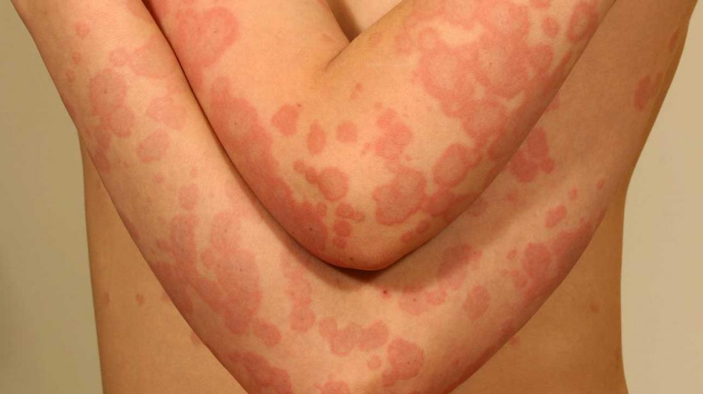

# Erythema multiforme
= EM  

---
## 💬 KURZ
- Harmlose, selbstlimitierende Entzündungsreaktion der Haut nach Infektion  
- Betrifft v. a. **Kinder und junge Erwachsene**  
- Typisch: schießscheibenartige Hautläsionen  

{width=„200“}
([Bild 1](https://cdn-prod.medicalnewstoday.com/content/images/articles/323/323801/erythema-multiforme-on-a-childs-elbows-br-image-credit-dermnet-new-zealand-br.jpg))

---
## ❓ URSACHE
- Häufigster Auslöser: **Herpes-simplex-Virus Typ 1 (HSV-1)**  
- Seltener: andere Infektionen (Mycoplasma pneumoniae, HSV-2, EBV) oder Medikamente  

---
## 🚑 KLINIK
- Zunächst kleine runde Makulae  
- Dann typische **„target lesions“**: schießscheibenartige Plaques mit lividem Zentrum, ggf. Bläschen  
- Beginn an den **Akren** (Hände, Füße) mit Ausbreitung nach proximal  
- Juckreiz (Pruritus) häufig  
- Schleimhautbeteiligung möglich, aber nicht obligat (DD zu [SJS/TEN](Stevens-Johnson-Syndrom.md))  

---
## 🩺 DIAGNOSTIK
- Klinische Diagnose (typische Hautläsionen, Anamnese mit vorausgegangener Infektion)  
- **Labor meist unauffällig**  
- Hautbiopsie nur bei unklaren Fällen  

---
## 🏥 THERAPIE
- Meist selbstlimitierend innerhalb von 2–3 Wochen  
- Symptomatisch:  
	- Antihistaminika  
	- ggf. topische Glukokortikoide  
- Bei schweren oder rezidivierenden Verläufen: 
	- systemische Glukokortikoide  
- Rezidivprophylaxe:  
	- **Aciclovir** über 3–6 Monate bei HSV-assoziiertem EM  

---

🔤 Abkürzungen

<table>
<thead>
<tr><th>Abkürzung</th><th>Bedeutung</th></tr>
</thead>
<tbody>
<tr><td>EM</td><td>Erythema multiforme</td></tr>
<tr><td>HSV</td><td>Herpes-simplex-Virus</td></tr>
<tr><td>SJS</td><td>Stevens-Johnson-Syndrom</td></tr>
<tr><td>TEN</td><td>Toxische epidermale Nekrolyse</td></tr>
<tr><td>DD</td><td>Differentialdiagnose</td></tr>
</tbody>
</table>

📚 Quellen

<ol>
<li>DocCheck Flexikon: <a href="https://flexikon.doccheck.com/de/Erythema_multiforme">Erythema multiforme</a></li>
<li>MSD Manual: <a href="https://www.msdmanuals.com/de/profi/erkrankungen-der-haut/entz%C3%BCndliche-hauterkrankungen/erythema-multiforme">Erythema multiforme</a></li>
<li>Altmeyers Enzyklopädie: <a href="https://www.altmeyers.org/de/dermatologie/erythema-multiforme-10618">Erythema multiforme</a></li>
</ol>

🏷️ Tags

#Dermatologie #Infektiologie #Kinderheilkunde #Haut #HSV #ErythemaMultiforme  

