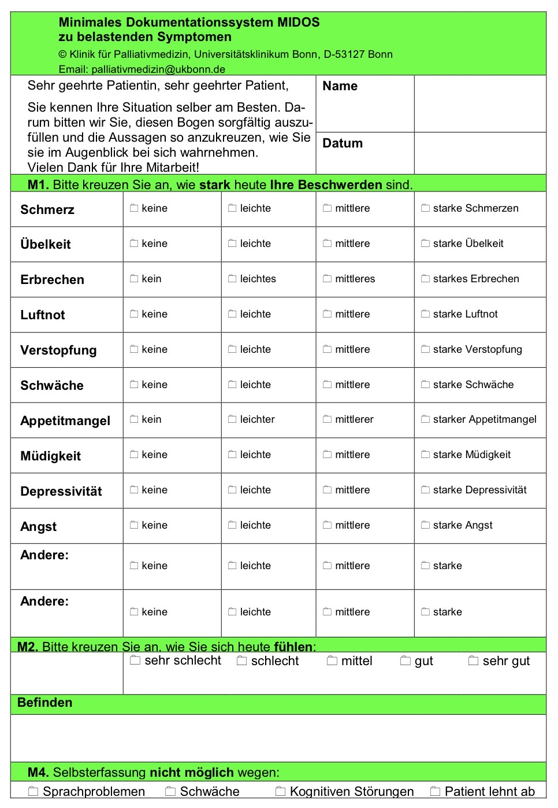

# Fatigue
= Müdigkeit, Mattigkeit, Erschöpfung

---
## 📊 EPIDEMIOLOGIE
- ca. 70–90% bei Tumorerkrankten
- ca. 30-60% bei [[Anästhesie bei Long COVID|Long COVID]]

---
## ⚙️ PATHOGENESE 
#### 1. Erschöpfungstheorie  
   → Folge des psychischen und physischen Stresses durch die lang anhaltende Belastung der Tumorerkrankung

#### 2. Neurophysiologische Theorie  
   → Durch Erkrankung und Therapie bedingte umfassende Schädigung der Muskelfasern, der neuromuskulären Übertragung und des Nervensystems auf allen Ebenen, insbesondere des Hypothalamus

#### 3. Stoffwechseltheorie
   → Durch Tumorzellen oder Therapeutika produzierte Stoffe bewirken eine Veränderung des Fett- und Proteinstoffwechsels

#### 4. Biophysiologisches Modell („Pipermodel“) – fasst 1–3 zusammen  
   - Ansammlung schädlicher Stoffwechselprodukte  
   - Änderungen im Energiestoffwechsel  
   - Die Grunderkrankung  
   - Therapiefolgeerscheinungen  
   - Änderungen der neuronalen Übertragung  
   - Sauerstoffversorgung des Patienten  
   - Bisheriger Schlaf‑Wach‑Rhythmus  
   - Individuelle Stress- und Krankheitsbewältigungsmuster  
   - Prägende Ereignisse des bisherigen Lebens  
   - Umgebung und Umwelt des Patienten  
   - Individuelle Faktoren  

---
## 🚑 KLINIK 
- Schlafen ist nicht erholsam  
- Schwäche, Kraftlosigkeit  
- Hilflosigkeit, Reizbarkeit, Traurigkeit, Angst, Antriebslosigkeit  
- Appetitlosigkeit  

---
## 🩺 DIAGNOSTIK 
- z. B. MIDOS‑Symptomerhebungsbogen (Bild 1)
	→ https://www.dgpalliativmedizin.de/images/Fragebogen_MIDOS2_2019.pdf

{ width="200"}

(Bild 1)

---
## 🔀 DIFFERENTIALDIAGNOSEN
- Anorexie‑/Kachexie‑Syndrom  
- Depression  
- Nebenwirkungen von Medikamenten  
- Anämie  
- Infekte  
- chronische Schmerzen  
- Schlafstörungen  

---
## 🏥 THERAPIE 
→ multimodales Therapiekonzept  
→ vor allem nicht‑medikamentöse Maßnahmen

#### 1. Allgemein 💬
- regelmäßige körperliche Aktivität / Physiotherapie  
- gezieltes körperliches Widerstandstraining  
- psychosoziale Therapie / Interventionen  
- Verhaltenstherapie (keine tiefenpsychologische Therapie)  
- Tagesablauf planen  
- viele kleine Pausen („Power Naps“)  
- geregelter Mittagsschlaf  
- Verbesserung des Nachtschlafs  
- Soziale Unterstützung aktivieren bzw. nutzen:  
	- Freunde  
	- Hospizdienst  
	- Krankenkasse  
	- Sozialdienst des Krankenhauses  
	- Selbsthilfegruppen  

#### 2. Ursachenspezifisch 🎯 
- Anämie ausgleichen  
- Elektrolytverschiebungen ausgleichen  
- Begleiterkrankungen behandeln  

#### 3. Medikamente 💊
**Stimulanzien:**  
- Methylphenidat („Ritalin“): 
	- 5–30 mg/Tag  
	- Einnahme: 30 min vor gewünschtem Effekt  
	- Wirkdauer: 2–4 h  
	- Vorteile: günstig (~20 €)  
	- Nachteile: Übelkeit/Erbrechen, Appetit↓, Depression  
- Modafinil („Vigil“): 
	- 100 mg/Tag (max. 200 mg/Tag)  
	- CAVE🚨: kardiovaskuläre Nebenwirkungen  
	- Nachteile: teuer 💰, Übelkeit/Erbrechen, Appetit↓, Depression  
- Dexamethason: 
	- 4–8 mg/Tag  

**Schlaffördernde Medikamente:**  
- nur am Abend  
- möglichst Präparate mit kurzer Wirkdauer  

---

🔤 Abkürzungen

<table>
  <thead>
    <tr>
      <th>Abkürzung</th>
      <th>Bedeutung</th>
    </tr>
  </thead>
  <tbody>
    <tr><td>BGA</td><td>Blutgasanalyse</td></tr>
    <tr><td>CAVE</td><td>(lat. „Vorsicht!“) – Hinweis auf besondere Gefahren oder wichtige Merkpunkte</td></tr>
    <tr><td>mg</td><td>Milligramm</td></tr>
    <tr><td>MIDOS</td><td>Minimal Documentation System – Fragebogen zur Symptomerhebung</td></tr>
  </tbody>
</table>

📚 Quellen

<ol>
  <li>Preuss S. Basiskurs Palliativmedizin. Seminarunterlagen. 26. Januar 2025.</li>
  <li>Krizanits F. Modul I Palliativmedizin. Seminarunterlagen. 14. Februar 2025.</li>
  <li>Deutsche Fatigue Gesellschaft. Informationsmaterial zu Fatigue und MIDOS.  
    <a href="https://deutsche-fatigue-gesellschaft.de/service/infomaterial">https://deutsche-fatigue-gesellschaft.de/service/infomaterial</a> (Zugriff am 22.09.2025)
  </li>
</ol>

🏷️ Tags

#Fatigue #Palliativmedizin #Depression #COVID #LongCovid  

