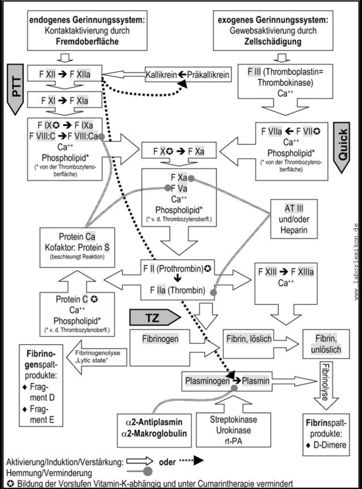

# Fibrinogen
= Gerinnungsfaktor I

### 🔎 NORMWERTE
- **200–400 mg/dl** (≈ 2–4 g/l)  
- **Kritisch:** <150 mg/dl oder <7 mm im FIBTEM  
- **Wichtig:** 
	→ Fibrinogen ist ein Akute-Phase-Protein 
	→ erhöht bei Entzündung, Trauma, Tumor
	→ das heißt oft **falsch-hoch** 😉

---

### 💊 DOSIERUNG
- **25–50 mg/kg** (≈ 2–6 g)  
- **1 g i.v.** erhöht Fibrinogen um ca. **25–30 mg/dl**  
- **Zielwert:** ≥150–200 mg/dl (bei schwerer Blutung ggf. höher)  

---

### 📌 KLINISCHE HINWEISE
- **Funktion:** 
	- Vorstufe von Fibrin
	- essenziell für Gerinnselstabilität  
- **Mangelursachen:** 
	- Verbrauch (DIC, massive Blutung)
	- Leberinsuffizienz
	- selten kongenital  
- **Therapieoptionen:** 
	- Fibrinogenkonzentrat (Standard)
	- [Fresh Frozen Plasma](Fresh%20Frozen%20Plasma.md)
	- alternativ Kryopräzipitat (nicht überall verfügbar)  
- **Monitoring:** 
	- ROTEM/TEG (FIBTEM)
	- Labor-Fibrinogen (Clauss-Methode)  

(Bild 1)

---

### 🔤 Abkürzungen:

| Abkürzung | Bedeutung                                      |
|-----------|------------------------------------------------|
| DIC       | Disseminierte intravasale Koagulopathie        |
| i.v.      | intravenös                                     |
| mg/dl     | Milligramm pro Deziliter                       |
| mg/kg     | Milligramm pro Kilogramm Körpergewicht         |
| ROTEM     | Rotationsthromboelastometrie                   |
| TEG       | Thromboelastographie                           |
| FIBTEM    | Fibrinogen-spezifischer ROTEM-Test             |

---

### 📚 Quellen:
1. Laborlexikon – Fibrinogen: [http://www.laborlexikon.de/Lexikon/Infoframe/f/Fibrinogen.htm](http://www.laborlexikon.de/Lexikon/Infoframe/f/Fibrinogen.htm)
2. Anästhesiologie & Intensivmedizin 03/2018  
3. Patient Blood Management, Uni Frankfurt, 15.09.2018  

---

### 🏷️ Tags: 
#Gerinnung #Fibrinogen #FFP #Notfallmedizin #Intensivmedizin #OP 