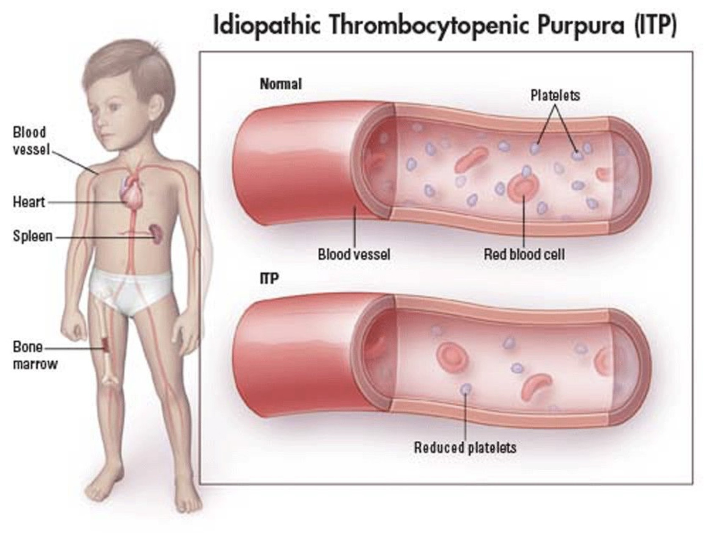
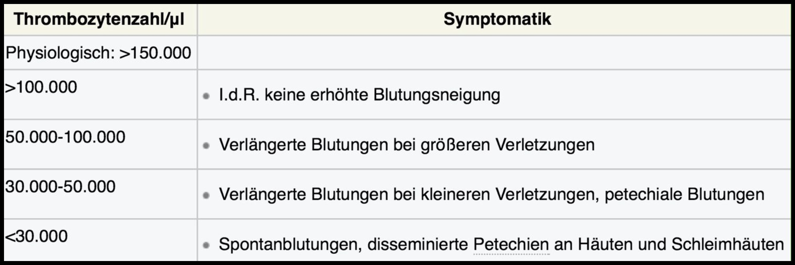

## ITP
= Idiopathisch Immunthrombozytopenische Purpura (ITP) mit AK gegen Thrombozyten  
= M. Werlhof  

{ width="200"}

(Bild 1)

---
## 🚨 CAVE / MERKE 💡
- Häufigste Blutungsneigung bei Kindern  
- Begleiterkrankung bei [[Anästhesie bei Long COVID|Long COVID]]  

---
## 🚑 KLINIK
- Blutungsneigung  
- Petechien *(Bild 2)*  
- Ausprägung je nach Anzahl der Thrombozyten *(Bild 3)*  

{width="200"}

(Bild 2)

{width="200"}

(Bild 3)

---
## 🩺 DIAGNOSTIK
- Verkürzte Thrombozytenlebenszeit  
  → Thrombozytopenie  
  → Reaktive Megakaryopoese  
- IgG‑Antikörper gegen Thrombozyten  

---
## 🏥 THERAPIE

#### Thrombozyten > 30.000/µl
- *Watch and wait*  
- Häufig Spontanremission  

#### Thrombozyten < 30.000/µl
- Thrombozytenkonzentrate (TKs)  
- Glukokortikoide  
- Immunsuppressiva  
- Immunglobuline i.v.  
- Splenektomie  
- Thrombopoetin‑Analoga  

---

  
🔤 Abkürzungen

  <table>
    <thead>
      <tr>
        <th>Abkürzung</th>
        <th>Bedeutung</th>
      </tr>
    </thead>
    <tbody>
      <tr><td>AK</td><td>Antikörper</td></tr>
      <tr><td>ITP</td><td>Idiopathisch Immunthrombozytopenische Purpura</td></tr>
      <tr><td>TK</td><td>Thrombozytenkonzentrat</td></tr>
      <tr><td>i.v.</td><td>intravenös</td></tr>
      <tr><td>IgG</td><td>Immunglobulin G</td></tr>
    </tbody>
  </table>

  
📚 Quellen

  <ul>
    <li>Miamed, 2014</li>
    <li>14. Gerinnungskurs Seeon, 13.07.2018</li>
  </ul>

  
🏷️ Tags

  
#Gerinnung #ITP #Hämatologie #Pädiatrie #LongCovid

