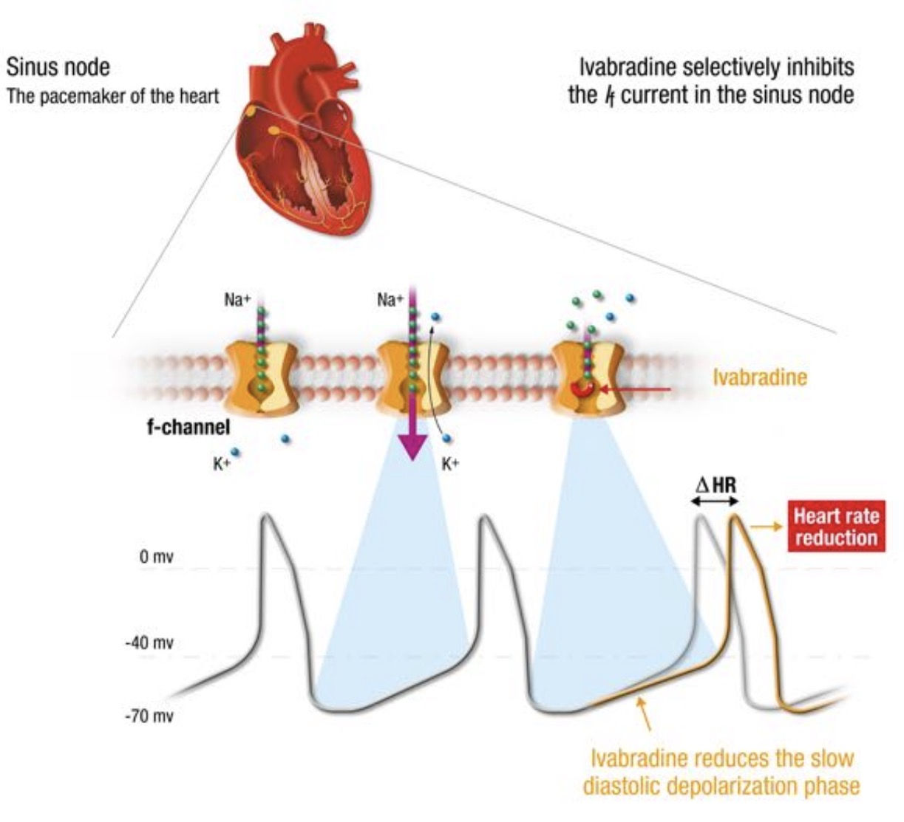

## Ivabradin
= If-Kanal-Hemmer  
= HCN4-Kanalblocker  

---
## 🚦 INDIKATIONEN
- Reservemittel  
	→ wenn [Betablocker](Betablocker.md) nicht ausreichen  
	→ wenn [Betablocker](Betablocker.md) kontraindiziert sind  
- Herzinsuffizienz NYHA II-IV  
- KHK  
- [[Anaesthesie-bei-Long-COVID|Long COVID]] (off-label)  

---
## ✨ WIRKUNG
- Herzfrequenz ↓  
	→ durch Blockierung des If-Kanals in den Schrittmacherzellen des Sinusknotens  
- langsamere diastolische Depolarisation  
	→ insbesondere unter Belastung  
	→ Reduktion der Herzfrequenz (ca. 5–10 bpm)  
	→ Senkung des myokardialen O₂-Verbrauchs  
	→ bessere Koronarperfusion  

{width="200"}  

(Bild 1)

---
## 💊 DOSIERUNG
- initial 5 mg, 1-0-1  
- ggf. nach 1 Monat auf 7,5 mg 1-0-1 steigern  
- DANI / DALI bei schwerer Insuffizienz  

---
## ❌ KONTRAINDIKATIONEN
- HF in Ruhe <60/min  
- schwere Herzerkrankungen  
	→ Herzinfarkt  
	→ instabile AP  
	→ AV-Block III°  
	→ SM-Abhängigkeit  
- Schwangerschaft / Stillzeit  

---
## 🌀 NEBENWIRKUNGEN
#### 1. kardiovaskulär ❤️
→ Bradykardie  
→ AV-Block I°  

#### 2. Augen 👁  
→ Sehstörungen  

#### 3. Sonstiges 💬  
→ CYP-Interaktionen  
→ Kopfschmerzen  
→ Schwindel  
→ Ü / E 🤮  

---

  
🔤 Abkürzungen

  <table>
    <thead>
      <tr>
        <th>Abkürzung</th>
        <th>Bedeutung</th>
      </tr>
    </thead>
    <tbody>
      <tr><td>AV</td><td>atrioventrikulär</td></tr>
      <tr><td>bpm</td><td>beats per minute (Schläge pro Minute)</td></tr>
      <tr><td>DALI</td><td>Dosisanpassung bei Leberinsuffizienz</td></tr>
      <tr><td>DANI</td><td>Dosisanpassung bei Niereninsuffizienz</td></tr>
      <tr><td>HF</td><td>Herzfrequenz</td></tr>
      <tr><td>KHK</td><td>Koronare Herzkrankheit</td></tr>
      <tr><td>NYHA</td><td>New York Heart Association (Klassifikation der Herzinsuffizienz)</td></tr>
      <tr><td>SM</td><td>Schrittmacher</td></tr>
      <tr><td>Ü / E</td><td>Übelkeit / Erbrechen 🤮</td></tr>
    </tbody>
  </table>

  
📚 Quellen

  <ul>
    <li>Miamed, 29.10.2018</li>
    <li><a href="https://www.kardiologie.org/neue-leitlinien-zur-herzinsuffizienz-was-hat-sich-geaendert-/10211996">Neue Leitlinien zur Herzinsuffizienz – kardiologie.org</a></li>
    <li>Medizinische Klinik – Intensivmedizin und Notfallmedizin „Notfalltherapie der Bradykardien“, 06/2018</li>
    <li>Arzneimittel pocket App, Version 2.1, 29.10.2018</li>
  </ul>

  
🏷️ Tags

  
#Pharma #Ivabradin #Tachykardie #If-Kanal-Hemmer #Medikament

