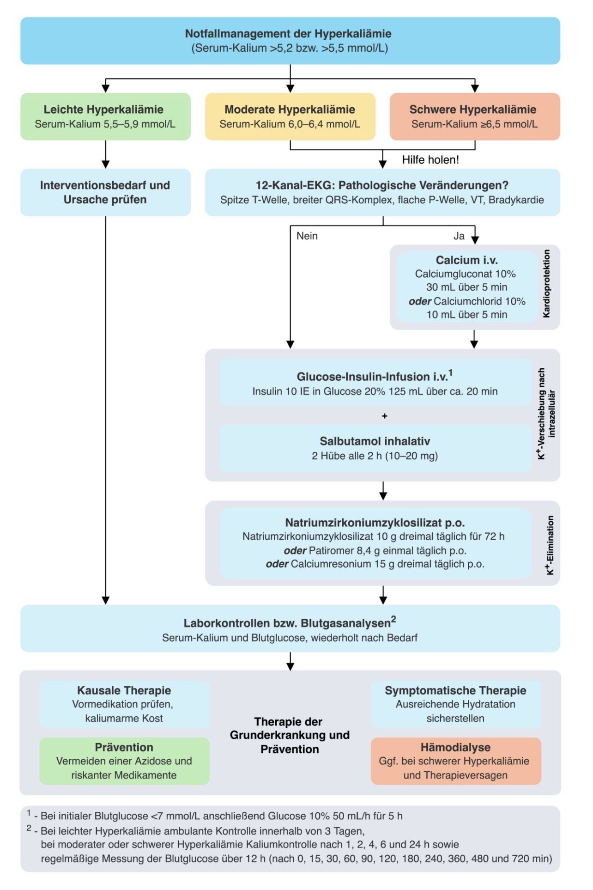

# Kalium

---
## 🔎 NORMWERTE
- Serum: **3,5–5,3 mmol/l**  
- Täglicher Bedarf: **1–2 mmol/kg**  
	  ➔ entspricht ca. 100 mmol bzw. 4 g pro Tag  

---
## ❓ URSACHEN

#### 1. Hypokaliämie
- **Verlust**  
	- Hyperaldosteronismus / -cortisolismus
	- Medikamente: 
		→ Laxantien, Diuretika, Glukokortikoide  
	- Lakritz
	- Erbrechen, Diarrhoe  
- **Umverteilung**
	- Alkalose
	- Insulin
	- Beta-Agonisten (z. B. *Salbutamol*)  

#### 2. Hyperkaliämie
- **Überschuss**
	- Niereninsuffizienz
	- Hypoaldosteronismus / -cortisolismus
	- Kaliumsparende Diuretika  
	- ACE-Hemmer, AT1-Blocker
	- Heparin, Ciclosporin, Trimethoprim
	- Zellzerfall (Hämolyse, Tumorlyse, Rhabdomyolyse)  
- **Umverteilung**
	- Azidose

---
## ⚙️ PATHOPHYSIOLOGIE
- K⁺ ist überwiegend intrazellulär.
- Hypokaliämie: 
	→ Membranpotential ↑ 
	→ Erregbarkeit ↓  
	→ tachykarde Herzrhythmusstörungen 
- Hyperkaliämie: 
	→ Membranpotential ↓ 
	→ Erregbarkeit ↑  
	→ bradykarde Herzrhythmusstörungen 

---
## 🚑 KLINIK

#### 1. Hypokaliämie
- tachykarde Herzrhythmusstörungen
	→ z. B. VES, SVES, VHF  
- Muskelschwäche
- Paresen, Reflexabschwächung  
- Obstipation  
- Polyurie ([ADH](ADH.md)-Resistenz 💡)

#### 2. Hyperkaliämie
- bradykarde Herzrhythmusstörungen
	→ z. B. AV-Block
- Muskelzucken, gesteigerte Reflexe  
- Parästhesien  

---
## 🩺 DIAGNOSTIK

#### 1. Labor 🧪 
- Serumkalium  
- BGA: pH-Bestimmung
	- Azidose → Hyperkaliämie
	- Alkalose → Hypokaliämie

#### 2. EKG 〽️

{ width="200"}

(Bild 1)

- **Hypokaliämie**: 
	- T-Abflachung 
		→ „no pot no tea“
		→ Kalium = eng. potassium 💡
	- ST-Senkung
	- TU-Verschmelzung
- **Hyperkaliämie**: 
	- hohe spitze T-Wellen
	- P-Abflachung
	- PQ-Zeit↑
	- QRS-Verbreiterung
	- QT↓  

---
## 🏥 THERAPIE
#### 1. Hypokaliämie
- Langsame Substitution
	- Rekawan (8 mmol, Tablette)
	- Kalinor Brause (40 mmol, Brausetablette)
	- K-Perfusor 7,45%: 1 ml = 1 mmol
		- peripher: max. 2 mmol/h
		- ZVK: 
			→ i.d.R. 10 mmol/h
			→ max. 20–40 mmol/h 
- Immer pH & Elektrolyte (inkl. Mg²⁺) kontrollieren  

#### 2. Hyperkaliämie

| Medi                           | Dosis               | WE      | WD       |
| ------------------------------ | ------------------- | ------- | -------- |
| *Calziumglukonat* 10%          | 30 ml (KI)          | sofort  | ~30 min  |
| *Reproterol*                   | 0,5 mg              | ~10 min | ~2 h     |
| *NaBiC 8,4%*                   | 50–100 mmol         | ~10 min | ~2 h     |
| *Furosemid*                    | 20–40 mg            | ~10 min | variabel |
| *Glukose 20% + Insulin*        | 200 ml + 20 IE (KI) | ~30 min | ~5 h     |
| *Resonium*                     | oral / rektal       | ~60 min | ~5 h     |
| [Hämodialyse](CiCa-Dialyse.md) | —                   | sofort  | —        |

**CAVE 🚨**  
- anstatt 30 ml *Calciumglukonat* auch 10 ml *Calciumchlorid* möglich
- Calcium **nicht** mit *NaBiC* kombinieren ⚠️ 
- *Resonium*: GI-Nebenwirkungen, zeitversetzte Einnahme anderer Medikamente beachten 

{width="200"}

(Bild 2)

**Kalium shiften**
- ***Calciumglukonat* 10%**: 30 ml i.v.
	→ wirkt sofort, Dauer nur 30 min
- **Beta-2-Mimetikum (z. B. *Reproterol*/*Salbutamol*)**: 
	→ Wirkung nach 10 min, Dauer ca. 2 h  
- ***Natriumbicarbonat* 8,4%**: 50–100 mmol i.v.
	→ Wirkung 10 min, Dauer ca. 2 h
- **200 ml Glukose 20% + 20 IE Insulin**
	→ wirkt erst nach 30 min, Dauer 5 h

**Kalium eliminieren**
- ***Furosemid***, 20-80 mg
	→ wirkt in 10 min
- ***Resonium***
	→ wirkt erst nach 60 min
	→ MS oder Einlauf
- **[Hämodialyse](CiCa-Dialyse.md)**
	→ ultima ratio
	→ wirkt sofort

---
## ❌ KOMPLIKATIONEN
#### 1. Hypokaliämie
- verstärkte Digitaliswirkung  
	→ K und Digitalis konkurrieren an der Na⁺/K⁺-ATPase
	→ weniger K → stärkere Digitaliswirkung  
#### 2. Hyperkaliämie
- lebensbedrohliche Rhythmusstörungen  
	→ Kammerflimmern, Asystolie  

---

  
🔤 Abkürzungen

  <table>
    <thead>
      <tr>
        <th>Abkürzung</th>
        <th>Bedeutung</th>
      </tr>
    </thead>
    <tbody>
      <tr><td><a href="ADH.md">ADH</a></td><td>Antidiuretisches Hormon</td></tr>
      <tr><td>AV-Block</td><td>Atrioventrikulärer Block</td></tr>
      <tr><td>BGA</td><td>Blutgasanalyse</td></tr>
      <tr><td>CaCl</td><td>Calciumchlorid</td></tr>
      <tr><td>GI</td><td>Gastrointestinal</td></tr>
      <tr><td>HRST</td><td>Herzrhythmusstörungen</td></tr>
      <tr><td>IE</td><td>Internationale Einheiten</td></tr>
      <tr><td>KI</td><td>Kontraindikation</td></tr>
      <tr><td>MS</td><td>Magensonde</td></tr>
      <tr><td>NaBiC</td><td>Natriumbicarbonat</td></tr>
      <tr><td>NaCl</td><td>Natriumchlorid</td></tr>
      <tr><td>VES</td><td>ventrikuläre Extrasystolen</td></tr>
      <tr><td>VHF</td><td>Vorhofflimmern</td></tr>
      <tr><td>SVES</td><td>supraventrikuläre Extrasystolen</td></tr>
      <tr><td>WE</td><td>Wirkungseintritt</td></tr>
      <tr><td>WD</td><td>Wirkdauer</td></tr>
      <tr><td>ZVK</td><td>Zentraler Venenkatheter</td></tr>
    </tbody>
  </table>

  
📚 Quellen

  <ul>
    <li>ITS Kurs 2018, KNN</li>
    <li>„Hyperkaliämie Management - Update 2018“, cme-kurs.de, 4.7.2018</li>
    <li>Miamed „Elektrolytstörungen Kalium“, 29.10.2018</li>
    <li>Wikipedia „Hypokaliämie“, 29.10.2018</li>
    <li>A&amp;I, 11/18</li>
  </ul>

  
🏷️ Tags

  
#Elektrolytstörungen #Hypokaliämie #Hyperkaliämie #Kalium

