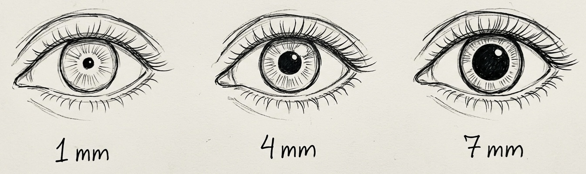

# Miosis
= **Pupillenverengung**
(*Stand: 03.04.2026*)

{width="200"}

---

> [!tip] Merkhilfe 💡
> Langes Wort = [Mydriasis](Mydriasis.md) = große Pupille
> Kurzes Wort = Miosis = kleine Pupillen

---
## 💬 KURZ
- Verengung der Pupille durch:  
	- **Parasympathikusaktivierung** (M. sphincter pupillae) oder  
	- **Sympathikushemmung**  
- Physiologisch (Helligkeit, Nahakkommodation) oder pathologisch/pharmakologisch bedingt  

---
## 🚨 CAVE / MERKE 💡
- **Notfall:** **Beidseitige Miosis** bei  
	- **Opiatintoxikation** (z. B. Heroin, Fentanyl) oder  
	- **Pontinläsion** (z. B. Ponsblutung)  
- **Pharma:**  
	- **Cholinergika** (Pilocarpin, Physostigmin)  
	- **Opiate**  
	- **Clonidin**  
- **Enge („stecknadelförmige“) Pupillen** (< 1 mm)  
	= **Opiat-Vergiftung bis zum Beweis des Gegenteils!**  

> [!note] Info
> „stecknadelförmige Pupillen“ = „Pinpoint-Pupils“ auf Englisch 😉

---
## ❓ URSACHEN
| **Ätiologie**       | **Beispiele**                  |
|---------------------|--------------------------------|
| **Physiologisch**   | Helligkeit, Nahsicht           |
| **Pharmakologisch** | Morphin, Pilocarpin, Clonidin  |
| **Neurologisch**    | Horner-Syndrom, Pontinläsion   |
| **Toxisch**         | Opiate, Organophosphate (früh) |
| **Entzündlich**     | Iritis, Uveitis                |

---
## 🔀 DD einseitig vs. beidseitig
- **Einseitig:** **Horner-Syndrom** (Ptosis + Enophthalmus + Anhidrosis)  
- **Beidseitig:** Opiate, Cholinergika, Pontinläsion  

---
<html>

🔤 Abkürzungen

<table>
  <tr><td>DD</td><td>Differenzialdiagnose</td></tr>
</table>

</html>

<html>

📚 Quellen

<ul>
  <li><i>Neurologie</i>, Mattle & Mumenthaler, 7. Aufl. 2020.</li>
  <li><i>Notfallmedizin</i>, Sefrin, 6. Aufl. 2021.</li>
  <li>UpToDate: "Pupillary abnormalities" (Zugriff: 03.04.2026).</li>
</ul>

</html>

<html>

🏷️ Tags

#Miosis #Pupille #Neurologie #Notfall #Pharmakologie #Ophthalmologie #Opiate #Cholinergika #HornerSyndrom #Pontinläsion #PinpointPupils #Intoxikation

</html>