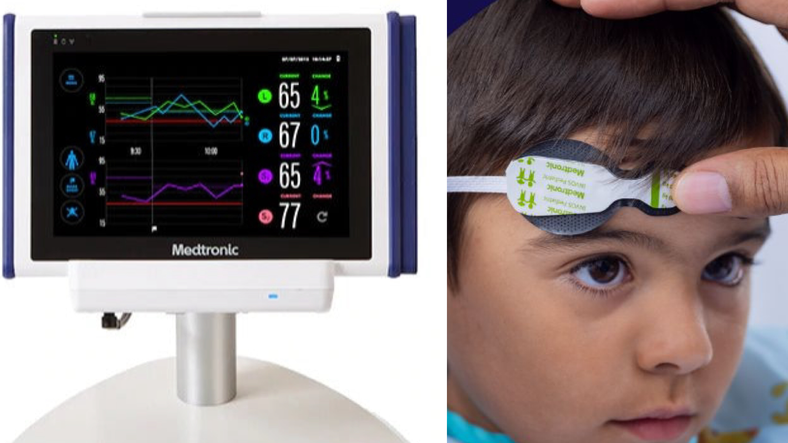

# NIRS
= Nahinfrarotspektroskopie

{width="200"}
(Bild 1)

---
## 💬 KURZ
- ermöglicht die kontinuierliche Messung der regionalen zerebralen Sauerstoffversorgung.  
- Bei Carotis-Operationen unter Vollnarkose ist NIRS besonders wertvoll, da neurologische Tests nicht möglich sind.  

---
## 💡 ANWENDUNG 
- Anlage von **2 Optoden frontal** (rechts/links)
- Haut entfetten wie bei EEG/Narcotrend®
- **Basiswert vor Narkoseeinleitung** erfassen  
	→ für ca. 1 min  
- **Normbereich: 60–80 %**  
- Warnschwelle:  
	→ Abfall >20 % relativ oder  
	→ Abfall <50 % absolut  
- **Dynamik ist relevanter** als absolute Werte 😉
- Limitation: Störung durch extrakranielles Gewebe, nur regionale Überwachung

---
## ⚙️ PATHOPHYSIOLOGIE
- NIRS misst Absorptionsspektren von Oxy-/Desoxyhämoglobin
- Signal repräsentiert arterielles, kapilläres und venöses Blut im Messkegel
- Limitation: isolierte fokale Ischämien können übersehen werden

---
## 🚦 INDIKATIONEN
- Carotis-OP unter Vollnarkose
- Kardiochirurgie mit Risiko für Hypoxie
- Patienten mit cerebrovaskulären Erkrankungen oder eingeschränkter Kompensationsfähigkeit

---
## 🏥 THERAPIE
- Intervention bei Abfall >20 % oder <50 % absolut:  
	- Hämodynamik optimieren  
	- Oxygenierung verbessern  
	- Hb-Konzentration korrigieren  
	- Tiefe der Sedierung anpassen

---

🔤 Abkürzungen

<table>
  <thead>
    <tr><th>Kürzel</th><th>Bedeutung</th></tr>
  </thead>
  <tbody>
    <tr><td>BIS</td><td>Bispektralindex</td></tr>
    <tr><td>CEA</td><td>Carotisendarteriektomie</td></tr>
    <tr><td>EEG</td><td>Elektroenzephalogramm</td></tr>
    <tr><td>FiO₂</td><td>inspiratorische Sauerstofffraktion</td></tr>
    <tr><td>Hb</td><td>Hämoglobin</td></tr>
    <tr><td>ICP</td><td>intrakranieller Druck</td></tr>
    <tr><td>MAC</td><td>minimale alveoläre Konzentration</td></tr>
    <tr><td>NIRS</td><td>Near-Infrared Spectroscopy</td></tr>
    <tr><td>PaCO₂</td><td>arterieller Kohlendioxidpartialdruck</td></tr>
    <tr><td>pEEG</td><td>prozessiertes EEG</td></tr>
    <tr><td>TCD</td><td>transkranielle Doppler-Sonographie</td></tr>
  </tbody>
</table>

📚 Quellen

<ul>
  <li>Duarte-Gamas L et al. <em>Scand J Surg</em>. 2024 – Systematic review on NIRS accuracy in CEA</li>
  <li>Siqueira LC et al. <em>Open Cardiovasc Med J</em>. 2022 – NIRS monitoring during CEA under GA</li>
  <li>Kondov S et al. <em>Interdiscip CardioVasc Thorac Surg</em>. 2023 – Routine vs selective NIRS-guided shunting</li>
  <li>Feinstein I, Angst MS. <em>BMJ</em>. 2025;388:r539</li>
  <li>Engelhard K. <em>Anästh Intensivmed</em>. 2021;62:410–416 – Nichtinvasives Neuromonitoring</li>
  <li>Bolkenius D, Dumps C, Rupprecht B. <em>Der Anaesthesist</em>. 2021;70:190–203</li>
  <li>Salter B, Baron E. <em>Cambridge Univ Press</em>. 2020</li>
  <li>Lukaszewski M, Nelke K. <em>Anesthesia Research</em>. 2024</li>
  <li><em>BJA Education</em> – Cerebral oximetry overview</li>
</ul>

🏷️ Tags

#NIRS #CarotisOP #Anästhesie #Neuromonitoring #CerebralOximetry #PerioperativeMedizin #Schlaganfallprävention #EEG #TCD #pEEG #Monitoring #Gefäßchirurgie #Kardiochirurgie #Patientensicherheit  

