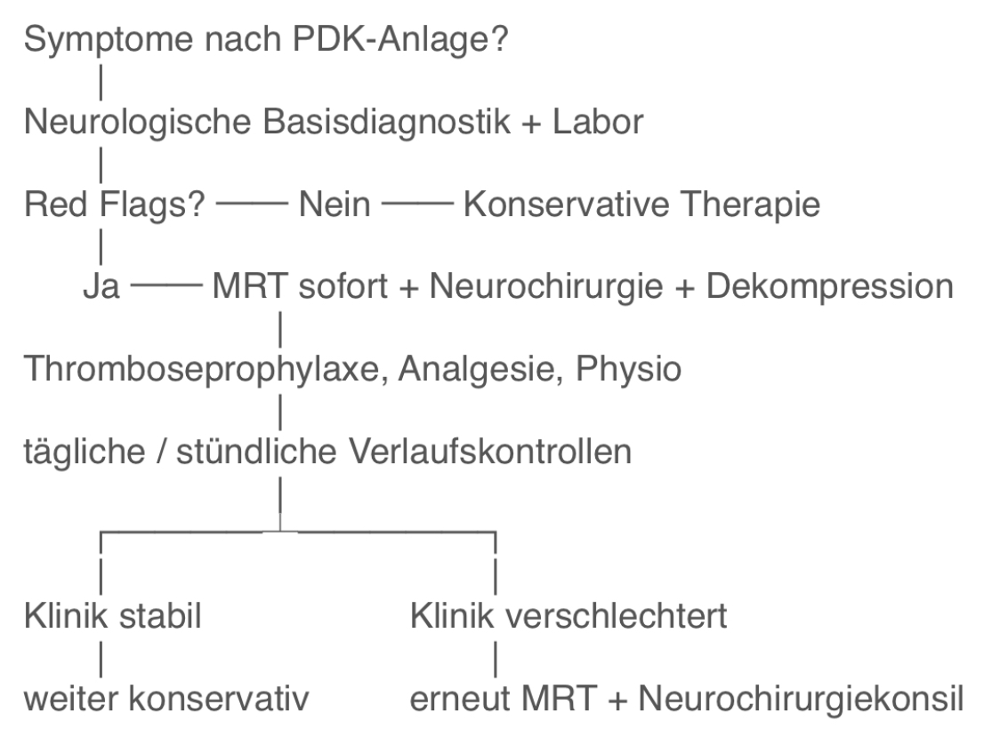

## PDK - Vorgehen bei postinterventioneller Parese oder Parästhesie

---

## 🚑 KLINIK

#### 1. Allgemein 💬
* (Teil-) Parese eines Beins  
* Parästhesien im Dermatombereich  
* Sensibilitätsverlust für Berührung, Temperatur oder Schmerz  
* Reflexveränderungen (verzögert oder ausfallend)  

#### 2. Red Flags 🚩
* Rasch progrediente Lähmungen  
* Starke Schmerzen untypisch für PDK  
* Fieber >38°C  
* Miktions- oder Defäkationsstörungen  

---

## ❓ URSACHEN

| Kategorie     | Ursache                        | Charakteristika                      |
| ------------- | ------------------------------ | ------------------------------------ |
| Mechanisch    | Epidurales Hämatom             | akuter Schmerz, progrediente Lähmung |
| Entzündlich   | Epiduraler Abszess             | Fieber, CRP ↑                        |
| Traumatisch   | Nervenläsion                   | sofortiges Einsetzen, einseitig      |
| Toxisch       | Neurotoxizität                 | persistierende Defizite              |
| Ischämisch    | Gefäßkompression / Vasospasmus | plötzlicher Beginn, Schmerz          |
| Immunologisch | Aseptische Meningitis          | Kopfschmerz, Nackensteifigkeit       |
| Funktionell   | Konversionsstörung             | fluktuierender Verlauf               |

---

## 🩺 DIAGNOSTIK

#### 1. Neurologische Basisdiagnostik 🧠
* sofort!  
* Kraftgrad M0–M5  
* Sensibilität (Berührung, Schmerz, Temperatur)  
* Reflexstatus  

#### 2. Labor 🧪
* CRP, Leukozyten, Blutkulturen  
* Gerinnung (aPTT, INR, Thrombozyten)  

#### 3. Bildgebung 🩻
* MRT lumbosakral mit Kontrast ➔ innerhalb 2 Stunden bei Red Flags  
* Alternativ: CT bei MRT-Kontraindikation  

#### 4. Elektrophysiologie ⚡️
* ENG/EMG frühestens 3–4 Wochen nach Symptombeginn  

---

## 🏥 THERAPIE

#### 1. Notfallmaßnahmen 🆘
* Neurochirurgiekonsil bei Verdacht auf Hämatom/Abszess  
* Dekompression innerhalb 6 h bei belegbarer Kompression  

#### 2. Allgemein 💬
* Physiotherapie  

#### 3. Medikamente 💊
| Kategorie     | Ursache                        | Charakteristika                      |
| ------------- | ------------------------------ | ------------------------------------ |
| Mechanisch    | Epidurales Hämatom             | akuter Schmerz, progrediente Lähmung |
| Entzündlich   | Epiduraler Abszess             | Fieber, CRP ↑                        |
| Traumatisch   | Nervenläsion                   | sofortiges Einsetzen, einseitig      |
| Toxisch       | Neurotoxizität                 | persistierende Defizite              |
| Ischämisch    | Gefäßkompression / Vasospasmus | plötzlicher Beginn, Schmerz          |
| Immunologisch | Aseptische Meningitis          | Kopfschmerz, Nackensteifigkeit       |
| Funktionell   | Konversionsstörung             | fluktuierender Verlauf               |

---

## ⏰ VERLAUFSKONTROLLE
| Untersuchung     | Zeitpunkt                                                |
|------------------|----------------------------------------------------------|
| Neurologie       | stündlich (in den ersten 6h), dann alle 4h              |
| Vitalparameter   | stündlich (in den ersten 6h), dann alle 4h              |
| CRP, Leukozyten  | täglich (in den ersten 3d)                              |
| Bildgebung       | bei klinischer Verschlechterung, spätestens nach 7d     |
| ENG/EMG          | 3–4 Wochen nach Symptombeginn                           |

---

## 📊 FLOWCHART

{ width="50%"}

---

  
🔤 Abkürzungen

  <table>
    <thead>
      <tr>
        <th>Abkürzung</th>
        <th>Bedeutung</th>
      </tr>
    </thead>
    <tbody>
      <tr><td>aPTT</td><td>aktivierte partielle Thromboplastinzeit</td></tr>
      <tr><td>CRP</td><td>C-reaktives Protein</td></tr>
      <tr><td>CT</td><td>Computertomographie</td></tr>
      <tr><td>EMG</td><td>Elektromyographie</td></tr>
      <tr><td>ENG</td><td>Elektroneurographie</td></tr>
      <tr><td>INR</td><td>International Normalized Ratio (Gerinnungswert)</td></tr>
      <tr><td>MRT</td><td>Magnetresonanztomographie</td></tr>
      <tr><td>PDK</td><td>Periduralkatheter</td></tr>
    </tbody>
  </table>

  
📚 Quellen

  <ul>
    <li>Aminoff, M. J., & Hahn, K. (2020). Taubheitsgefühl, Kribbeln und Sensibilitätsverlust. In: Harrison’s Innere Medizin. Berlin: Thieme.</li>
    <li>Popkirov, S. (2020). Funktionelle Paresen und Sensibilitätsstörungen. Springer. DOI-Link</li>
    <li>Urban, P. (2022). Klinisch-neurologische Untersuchungstechniken. Thieme Verlag.</li>
    <li>DGN (2024). S1-Leitlinie: Diagnostik bei Polyneuropathien. AWMF-Leitlinienregister</li>
    <li>Fobbe, G. et al. (2020). Praxisleitfaden Ärztlicher Bereitschaftsdienst. Elsevier.</li>
    <li>Müller-Felber, W. (2016). Lähmung (Parese). Springer. Springer-Link</li>
    <li>DocCheck Flexikon. (n.d.). Parese. Flexikon-Link</li>
    <li>DEXIMED (2025). Parästhesien. DEXIMED-Link</li>
  </ul>

  
🏷️ Tags

  
#PDK #Komplikation #Periduralkatheter #Periduralanästhesie

