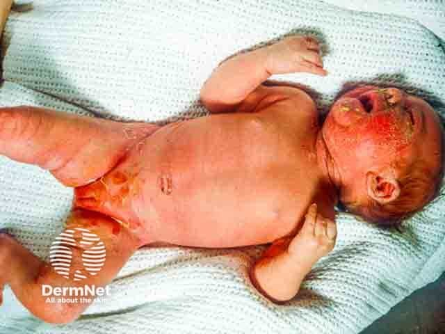

# Staphylococcal Scalded Skin Syndrome
= SSSS  
= Ritter-Krankheit  

{width=„200“}
([Bild 1](https://pro.dermnetnz.org/assets/collection/Staphylococcal-scalded-skin-syndrome/staphylococcal-scalded-skin-syndrome-0013.jpg))

---
## 💬 KURZ
- Lebensbedrohliche Hauterkrankung durch Staphylokokken-Toxine  
- Führt zu großflächiger Blasenbildung und Hautablösung  
- Betroffen sind v. a. Säuglinge, Kleinkinder und immunsupprimierte Erwachsene  

---
## ❓ URSACHE
- Erreger: **Staphylococcus aureus**  
- Toxine: **Exfoliatin A & B**  
- Risikogruppen: Säuglinge, Kleinkinder, immunsupprimierte Erwachsene  

---
## 🚑 KLINIK
- Hohes Fieber 🤒  
- Rötung des gesamten Körpers  
- Blasenbildung → reißen leicht  
- Nach Blasenruptur: großflächige Erosionen  
- **Keine Schleimhautbeteiligung** 
	→ wichtiges DD zu [SJS/TEN](Stevens-Johnson-Syndrom.md)  

---
## 🩺 DIAGNOSTIK
- Kultur:  
	→ Nachweis von *Staphylococcus aureus*  
- **Nikolski-Zeichen positiv** 
	→ obere Hautschichten lassen sich gegenüber unteren verschieben  
- Labor: 
	→ Entzündungsparameter ↑
	→ Elektrolytverluste möglich  

---
## 🔀 DIFFERENTIALDIAGNOSEN
| Merkmal      | **SSSS**                                       | **[SJS/TEN](Stevens-Johnson-Syndrom.md)**                    |
| ------------ | ---------------------------------------------- | ------------------------------------------------------------ |
| Hautbefall   | großflächig, Blasen, Erosionen                 | großflächig, Nekrosen                                        |
| Schleimhäute | **nicht** betroffen                            | **immer** betroffen                                          |
| Ursache      | *Staph. aureus* (Exfoliatin A/B)               | Medikamente (Sulfonamide, Antiepileptika, NSAR, Allopurinol) |
| Therapie     | Cephalosporine, ITS, **keine** Glukokortikoide | Absetzen Medis, Volumen, Antibiose, ggf. Glukokortikoide     |

---
## 🏥 THERAPIE
- Systemische Antibiose  
	- *Flucloxacillin*: 2 g, 1-1-1-1, 7d
		→ First-Line
	- *Cefazolin*: 2 g, 1-1-1, 7d
		→ Alternative
	- *Vancomycin*: 15 mg/kg, 1-0-1
		→ bei MRSA
- Intensivmedizinische Überwachung (Flüssigkeit, Elektrolyte, Temperaturkontrolle)  
- Wundmanagement ähnlich wie bei Verbrennungen  
- **Keine Glukokortikoide**  
	→ nur ggf. bei [SJS oder TEN](Stevens-Johnson-Syndrom.md)    

---

🔤 Abkürzungen

<table>
<thead>
<tr><th>Abkürzung</th><th>Bedeutung</th></tr>
</thead>
<tbody>
<tr><td>SSSS</td><td>Staphylococcal Scalded Skin Syndrome</td></tr>
<tr><td>SJS</td><td>Stevens-Johnson-Syndrom</td></tr>
<tr><td>TEN</td><td>Toxische epidermale Nekrolyse</td></tr>
<tr><td>KOF</td><td>Körperoberfläche</td></tr>
<tr><td>ITS</td><td>Intensivstation</td></tr>
</tbody>
</table>

📚 Quellen

<ol>
<li>MSD Manual: Staphylococcal Scalded Skin Syndrome</li>
<li>DocCheck Flexikon: SSSS</li>
<li>Altmeyers Enzyklopädie: Ritter-Krankheit</li>
<li>Drexler, Infectiology: Staphylococcus aureus Toxin-mediated diseases</li>
</ol>

🏷️ Tags

#Dermatologie #Infektiologie #Notfallmedizin #Intensivmedizin #Staphylokokken #Kinderheilkunde

