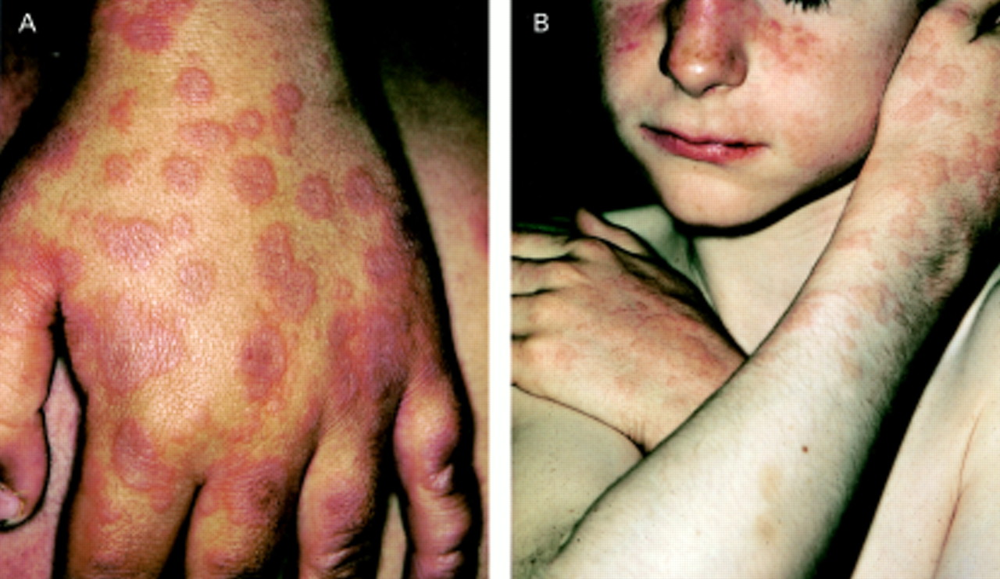
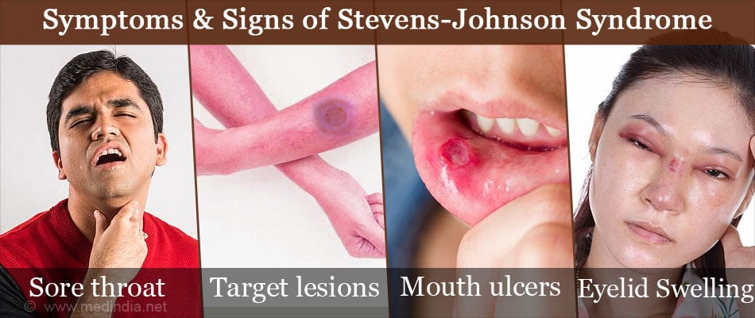

# Stevens-Johnson-Syndrom & Toxische epidermale Nekrolyse
= SJS / TEN
= Lyell-Syndrom

{width=„200“}
([Bild 1](https://adc.bmj.com/content/archdischild/83/4/347/F1.large.jpg))  

---
## 💬 KURZ
- seltene, immunologisch vermittelte, lebensbedrohliche Haut- und Schleimhauterkrankungen  
- meist eine Reaktion auf Medikamente  
	→ mit großflächiger Ablösung der Epidermis  

---
## 🚨CAVE / MERKE 💡
- **Letalität:** SJS ca. 5–10 %, TEN bis 50 %  

---
## ❓ URSACHEN
- Häufig Medikamente:  
	- Sulfonamide  
	- Antiepileptika (z. B. *Carbamazepin*, *Phenytoin*, *Phenobarbital*)  
	- *Allopurinol*  
	- NSAR (v. a. Oxicam-Derivate)  
	- [Paracetamol](Paracetamol.md)  
	- Antibiotika (Cephalosporine, Penicilline)  
- Seltener Infektionen:  
	- Mycoplasma pneumoniae  
	- Virusinfekt  

---
## ⚙️ PATHOGENESE
- immunologische Reaktion mit Apoptose von Keratinozyten → Ablösung der Haut  

---
## 📊 EINTEILUNG 
→ nach Hautbefall:  
  - <10 % KOF = SJS  
  - 10–30 % KOF = Übergangsform SJS/TEN  
  - >30 % KOF = TEN  

---
## 🚑 KLINIK
- **Prodromalstadium (1–3 Tage):** unspezifisch mit Fieber, Krankheitsgefühl, Konjunktivitis, Pharyngitis  
- **Hauptstadium:**  
	- hohes Fieber, starkes Krankheitsgefühl  
	- stammbetonte, teils konfluierende, makulöse oder targetoide Effloreszenzen  
	- nekrotische Ablösung der Epidermis („wie verbrüht“)  
	- **immer Schleimhäute betroffen** (oral, okulär, genital)  
	- Schmerzen, Flüssigkeitsverlust, Infektionsrisiko  

{width=„200“)
([Bild 2](https://images.medindia.net/patientinfo/950_400/symptoms-and-signs-of-stevens-johnson-syndrome.jpg))

--- 
## 🩺 DIAGNOSTIK
- Klinisch: 
	→ Haut- und Schleimhautablösung  
- Histologie:  
	→ nekrotische Keratinozyten  
	→ subepidermale Blasenbildung  
- Labor:  
	→ Entzündungsparameter ↑  
	→ Elektrolyte meist ↓ (Fieber & schwitzen 😉)  
	→ Leber- und Nierenwerte ↑  
- SCORTEN-Score zur Prognoseabschätzung  

✨ SCORTEN-Score (Details)

Der <strong>SCORTEN-Score</strong> ist ein validiertes Prognoseinstrument für Patienten mit TEN. Jeder Parameter gibt 1 Punkt, die Mortalität steigt mit der Punktzahl.

<table>
<thead>
<tr><th>Kriterium</th><th>Punkte</th></tr>
</thead>
<tbody>
<tr><td>Alter</td><td>&gt; 40 Jahre</td></tr>
<tr><td>Maligne Erkrankung</td><td>vorhanden</td></tr>
<tr><td>KOF-Befall</td><td>&gt; 10 % am Tag 1</td></tr>
<tr><td>Serum-Harnstoff</td><td>&gt; 10 mmol/l (&gt; 28 mg/dl)</td></tr>
<tr><td>Serum-Glukose</td><td>&gt; 14 mmol/l (&gt; 252 mg/dl)</td></tr>
<tr><td>Serum-Bikarbonat</td><td>&lt; 20 mmol/l</td></tr>
<tr><td>Herzfrequenz</td><td>&gt; 120/min</td></tr>
</tbody>
</table>

<strong>Mortalität nach Score:</strong>

<ul>
<li>0–1 Punkte → ca. 3 %</li>
<li>2 Punkte → ca. 12 %</li>
<li>3 Punkte → ca. 35 %</li>
<li>4 Punkte → ca. 58 %</li>
<li>≥5 Punkte → &gt; 90 %</li>
</ul>

---
## 🔀 DIFFERENTIALDIAGNOSEN
- [Staphylococcal-scaled-skin-syndrome](Staphylococcal-scaled-skin-syndrome.md) (SSSS)  
- Erythema multiforme  
- Verbrennungen  
- Arzneimittelexantheme  

---
## 🏥 THERAPIE
- Sofortiges Absetzen des auslösenden Medikaments  
- Intensivmedizinische Betreuung (Verbrennungsstation)  
- Supportiv: Volumen- und Elektrolytsubstitution, Schmerztherapie, sterile Wundversorgung  
- Infektionsprophylaxe, Antibiose nur bei nachgewiesener Sepsis  
- Ophthalmologische Mitbetreuung (Augenbeteiligung häufig)  
- Immunsuppressiva (z. B. Ciclosporin, IVIG) in Einzelfällen erwogen  
- **Glukokortikoide:** heute umstritten, nicht Standard  

---

🔤 Abkürzungen

<table>
<thead>
<tr><th>Abkürzung</th><th>Bedeutung</th></tr>
</thead>
<tbody>
<tr><td>KOF</td><td>Körperoberfläche</td></tr>
<tr><td>SJS</td><td>Stevens-Johnson-Syndrom</td></tr>
<tr><td>TEN</td><td>Toxische epidermale Nekrolyse</td></tr>
<tr><td>SSSS</td><td>Staphylococcal Scalded Skin Syndrome</td></tr>
<tr><td>IVIG</td><td>Intravenöse Immunglobuline</td></tr>
<tr><td>SCORTEN</td><td>Score zur Prognoseabschätzung bei TEN</td></tr>
</tbody>
</table>

📚 Quellen

<ol>
<li>MSD Manual: Stevens-Johnson-Syndrom und toxische epidermale Nekrolyse</li>
<li>DocCheck Flexikon: SJS / TEN</li>
<li>Altmeyers Enzyklopädie: Toxische epidermale Nekrolyse</li>
<li>Deximed: TEN</li>
<li>Gelbe Liste: Stevens-Johnson-Syndrom</li>
</ol>

 🏷️ Tags

#Dermatologie #Notfallmedizin #Intensivmedizin #Autoimmunreaktion #Medikamentennebenwirkung

