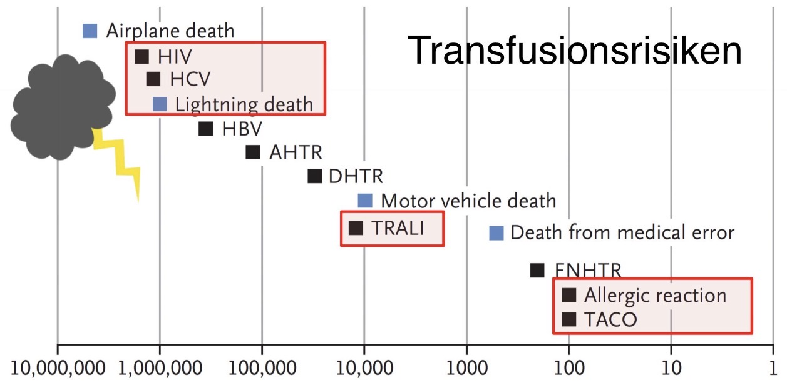

# TACO

### 💬 KURZ
- TACO ist eine transfusionsassoziierte **Volumenüberlastung** mit **akuter kardialer Dekompensation**. 
- Sie tritt meist innerhalb von 12 Stunden nach Transfusion auf und ist eine der **häufigsten** transfusionsbedingten Komplikationen.

---

### 🚨 CAVE / MERKE 💡
- Häufige Verwechslung mit **[TRALI](TRALI.md)**
- **Diuretika helfen bei TACO!
	→ wichtiges Unterscheidungsmerkmal❗️
- Eine der **häufigsten transfusionsassoziierten Todesursachen** (Bild 1)

---
### 📊 EPIDEMIOLOGIE
- Häufigste transfusionsassoziierte Komplikation in Industrienationen
- deutlich häufiger als [TRALI](TRALI.md)
- Inzidenz: 
	→ ca. 1:100–1:300 Transfusionen (Bild 1)
	→ unterdiagnostiziert
- Risikogruppen: 
	→ Ältere Patienten und Kinder
	→ Herz- oder Niereninsuffizienz

(Bild 1)

---

### ❓ URSACHEN
- Zu hohe Transfusionsgeschwindigkeit  
- Zu großes Transfusionsvolumen  
- Prädisposition bei Herz- oder Niereninsuffizienz  

---

### ⚙️ PATHOPHYSIOLOGIE
1. Akute Volumenüberlastung 
2. Linksherzinsuffizienz
	→ Anstieg des hydrostatischen Drucks in den Lungenkapillaren  
	→ Lungenödem  
3. Erhöhter venöser Rückstrom
	→ Stauungszeichen (Halsvenen, periphere Ödeme)  

---

### 🚑 KLINIK
- **Beginn**: akut oder innerhalb von 12 h
- **Respiratorisch** 🫁:
	→ Dyspnoe, Husten, Zyanose, Lungenödem  
- **Kardiovaskulär** ❤️:
	→ Tachykardie und Hypertonie
	→ Halsvenenstauung
	→ Zeichen der Herzinsuffizienz
	→ ggf. hypertensive Krise
- **Allgemein** 💬:
	→ Kopfschmerzen
	→ Unruhe  

---

### 🩺 DIAGNOSTIK
- **Pulmonal** 🫁:
	→ SpO₂ <90% unter Raumluft
	→ Rasselgeräusche  
- **Labor** 🧪:
	→ Hypoxämie, Hyperkapnie in der BGA
	→ proBNP ↑  
- **Bildgebung** 🩻:
	→ bilaterale Lungeninfiltrate  
- **Echokardiographie** 🫀:
	→ Zeichen der Volumenüberlastung  

---

### 🔀 DIFFERENTIALDIAGNOSEN
- **[TRALI](TRALI.md)**: Hypotonie, Fieber, keine Besserung durch Diuretika

| Merkmal            | [TACO](TACO.md)                                                                                             | TRALI                                                         |
| ------------------ | ----------------------------------------------------------------------------------------------------------- | ------------------------------------------------------------- |
| **Kurz**           | Volumenüberladung, Hypertonie, kard. Dekompensation, Lungenödem, Stauungszeichen, proBNP↑, Diuretika helfen | Immunologisch, Fieber, Hypotonie, ARDS-ähnlich, ggf. Beatmung |
| **Ursache**        | Volumenüberlastung, kardiale Dekompensation                                                                 | Immunologisch vermittelt (AK gegen Leukos)                    |
| **Beginn**         | Innerhalb von 12 h (meist sehr rasch)                                                                       | Innerhalb von 6 h                                             |
| **Klinik**         | Dyspnoe, **Hypertonie**, Halsvenenstauung, Lungenödem                                                       | Dyspnoe, **Hypotonie**, Fieber, Lungenödem                    |
| **Fieber**         | Selten                                                                                                      | Häufig                                                        |
| **Diuretika**      | Wirksam                                                                                                     | Keine Wirkung                                                 |
| **proBNP**         | Erhöht                                                                                                      | Normal                                                        |
| **Röntgen-Thorax** | Bilaterale Infiltrate (Stauungszeichen)                                                                     | Bilaterale Infiltrate (ARDS-ähnlich)                          |
| **Therapie**       | Transfusion stoppen, Diuretika, O₂, ggf. Beatmung                                                           | Supportiv, O₂, ggf. Beatmung, keine Diuretika                 |
| **Prognose**       | Gut bei rechtzeitiger Therapie                                                                              | Variabel, teils schwerer Verlauf                              |

- **ARDS**: ähnliche Bildgebung, aber andere Ursache (z. B. Sepsis)  
- **Anaphylaxie**: Bronchospasmus, Hautsymptome, Hypotonie  

---

### 🏥 THERAPIE
- Transfusion sofort stoppen  
- Oberkörperhochlagerung  
- Sauerstoffgabe, ggf. nicht-invasive oder invasive Beatmung (lungenprotektiv)  
- **Diuretika** (z. B. Furosemid)  
- Intensivmedizinische Überwachung bei schweren Verläufen  

---

### ⏰ VERLAUF
- Meist **gute Prognose** bei rechtzeitiger Therapie  
- Prävention:  
	  - langsame Transfusionsgeschwindigkeit  
	  - strenge Indikationsstellung  
	  - ggf. Diuretika-Prophylaxe bei Risikopatienten  

---

### 🔤 Abkürzungen:

| Abkürzung                     | Bedeutung                                   |
| ----------------------------- | ------------------------------------------- |
| **ARDS**                      | Acute Respiratory Distress Syndrome         |
| **BGA**                       | Blutgasanalyse                              |
| **BNP**                       | Brain Natriuretic Peptide                   |
| **NT-proBNP**                 | N-terminal pro Brain Natriuretic Peptide    |
| **O₂**                        | Sauerstoff                                  |
| **RR**                        | Blutdruck (Riva-Rocci)                      |
| **SpO₂**                      | Periphere Sauerstoffsättigung               |
| **TACO**                      | Transfusion Associated Circulatory Overload |
| **[TRALI](TRALI.md)** | Transfusion Related Acute Lung Injury       |

---

### 📚 Quellen:

1. Miamed. AMBOSS: Transfusionsmedizin – Transfusionsreaktionen. Berlin: Miamed GmbH; 2021.  
2. Larsen R. *Repetitorium Anästhesiologie*. 8. Auflage. Berlin, Heidelberg: Springer Medizin Verlag; 2015. S. 115–118.  
3. Lieberman L, Maskens C, Cserti-Gazdewich C, Hansen M, Lin Y, Pendergrast J, et al. Transfusion-associated circulatory overload: risk factors, outcomes, and prevention. *Transfusion*. 2014;54(1):34–43. doi:10.1111/trf.12238  
4. Tobian AA, Kleinman S, Tirnauer JS. Transfusion-associated circulatory overload (TACO). In: *UpToDate* [Internet]. Waltham, MA: Wolters Kluwer; 2025 [zitiert 2025 Sep 25]. Verfügbar unter: https://www.uptodate.com/contents/transfusion-associated-circulatory-overload-taco  
5. Serious Hazards of Transfusion (SHOT). *Transfusion-Associated Circulatory Overload (TACO) Cumulative Data*. SHOT Annual Reports 2012–2024. Birmingham, UK: SHOT; 2024. Verfügbar unter: https://www.shotuk.org/resources/transfusion-associated-circulatory-overload-taco-cumulative-data-2/  
6. Fink B, Antwerpes F. Transfusion-associated Circulatory Overload. In: *DocCheck Flexikon* [Internet]. Köln: DocCheck; 2023 [zitiert 2025 Sep 25]. Verfügbar unter: https://flexikon.doccheck.com/de/Transfusion-associated_Circulatory_Overload  
7. Clifford L, Singh A, Wilson GA, Toy P, Gajic O, Murphy EL, et al. Electronic health record surveillance algorithms facilitate the detection of transfusion-associated circulatory overload. *Transfusion*. 2013;53(6):1205–16. doi:10.1111/j.1537-2995.2012.03892.x  
8. Li G, Rachmale S, Kojicic M, Shahjehan K, Malinchoc M, Kor DJ, et al. Incidence and transfusion risk factors for transfusion-associated circulatory overload among medical intensive care unit patients. *Transfusion*. 2011;51(2):338–43. doi:10.1111/j.1537-2995.2010.02819.x  

---

### 🏷️ Tags:
#Bluttransfusion #PBM #TRALI #Diuretika #Hämotherapie #Transfusion #TACO #Komplikationen #Notfallmedizin 