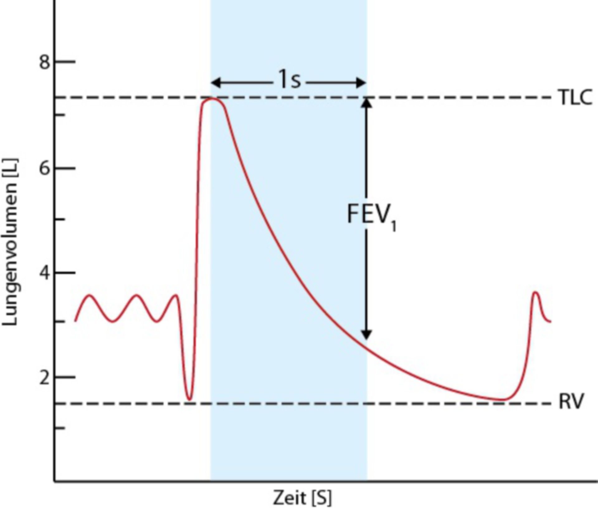

# Tiffeneau-Index  

## 📖 Definition
Der Tiffeneau-Index ist das Verhältnis von  
$$\text{FEV}_1 / \text{FVC}$$  
FEV₁ = forciertes exspiratorisches Volumen  
FVC = forcierte Vitalkapazität  

Der Index dient der Beurteilung des Strömungswiderstands der Atemwege und wird im Rahmen der Spirometrie gemessen.  

---
## 🫁 Durchführung (Spirometrie)
1. Maximale Inspiration  
2. Schnellstmögliche, vollständige Exspiration in ein Spirometer  
3. Messung von:  
	- FEV₁: Luftvolumen, das in der ersten Sekunde ausgeatmet wird  
	- FVC: Gesamtvolumen der forcierten Ausatmung  
4. Berechnung:  
$$\text{Tiffeneau-Index} = \frac{\text{FEV}_1}{\text{FVC}} \times 100\%$$  

{ width="200"}  

(Bild 1)  

---
## 📊 Normwerte
- Gesunde Erwachsene: ca. ≥ 70 % (nach GOLD-Kriterien)  
- Altersabhängig: Bei Jüngeren oft höher, bei Älteren physiologisch niedriger  
- LLN (Lower Limit of Normal) beachten, um Fehldiagnosen zu vermeiden  

---
## 🚑 Klinische Bedeutung
| Befund                     | Typische Interpretation                                                 |
| -------------------------- | ----------------------------------------------------------------------- |
| ↓ Tiffeneau-Index (< 70 %) | **Obstruktive Ventilationsstörung** (z. B. COPD, [[Asthma Bronchiale]]) |
| Normaler Index + ↓ FVC     | **Restriktive Ventilationsstörung** (z. B. Lungenfibrose)               |

{ width="200"}  

(Bild 2)  

---

  
🔤 Abkürzungen

  <table>
    <thead>
      <tr>
        <th>Abkürzung</th>
        <th>Bedeutung</th>
      </tr>
    </thead>
    <tbody>
      <tr><td>COPD</td><td>Chronic Obstructive Pulmonary Disease (chronisch obstruktive Lungenerkrankung)</td></tr>
      <tr><td>FEV₁</td><td>Forciertes exspiratorisches Volumen in 1 Sekunde</td></tr>
      <tr><td>FVC</td><td>Forcierte Vitalkapazität</td></tr>
      <tr><td>GOLD</td><td>Global Initiative for Chronic Obstructive Lung Disease</td></tr>
      <tr><td>LLN</td><td>Lower Limit of Normal (untere Normgrenze)</td></tr>
    </tbody>
  </table>

  

  
📚 Quellen

  <ul>
    <li><a href="https://flexikon.doccheck.com/de/Tiffeneau-Test">DocCheck Flexikon – Tiffeneau-Test</a>  
    Ausführliche Definition, Durchführung, Auswertung und diagnostische Bedeutung des Tiffeneau-Index.</li>
    <li><a href="http://lungenfunktion.eu/grundlagen/spirometrie-quantitativ.htm">lungenfunktion.eu – Spirometrie quantitativ</a>  
    Grundlagen der Spirometrie mit Messparametern, Normwerten und Interpretation bei obstruktiven und restriktiven Ventilationsstörungen.</li>
    <li><a href="https://www.altmeyers.org/de/innere-medizin/atemstosstest-nach-tiffeneau-110904">Altmeyers Enzyklopädie – Atemstoßtest nach Tiffeneau</a>  
    Medizinische Fachbeschreibung, Normbereiche und klinische Relevanz des Tiffeneau-Index.</li>
  </ul>

  

  
🏷️ Tags

  
#Pneumologie #Lungenfunktion #Spirometrie #TiffeneauIndex #MedizinBasics

