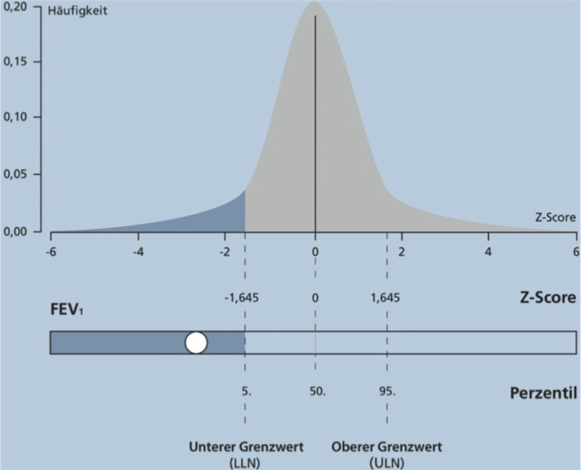

# Tiffeneau-Index  

---
## 📖 DEFINITION
Der Tiffeneau-Index ist das Verhältnis von  
$$\text{FEV}_1 / \text{FVC}$$  
FEV₁ = forciertes exspiratorisches Volumen  
FVC = forcierte Vitalkapazität  

→ Der Index dient der Beurteilung des Strömungswiderstands der Atemwege und wird im Rahmen der Spirometrie gemessen.  
→ Der Tiffeneau-Index ist ein dimensionsloses Verhältnis und wird üblicherweise in Prozent angegeben.  

**Ein erniedrigter Index diagnostiziert eine Obstruktion** 💡
	→ der ermittelte Prozentwert ist nicht absolut  
	→ dieser wird mit Normtabellen verglichen (GLI-Daten, s.u.)  
	→ diese Referenzdaten sind alters-, größen-, geschlechts- & ethnienspezifisch

> **Moderne Rolle des Tiffeneau‑Index**
> 
> • Dient **ausschließlich** zur **Diagnose** einer Obstruktion  
> 	→ FEV₁/FVC < LLN  
> • Der **Schweregrad** einer Obstruktion  
> 	→ richtet sich **nicht** nach dem Tiffeneau‑Index  
> 	→ sondern nach **FEV₁ (% Soll)**  

---
## 🫁 SPIROMETRIE
1. Maximale Inspiration  
2. Schnellstmögliche, vollständige Exspiration in ein Spirometer  
3. Messung von:  
	- FEV₁: Luftvolumen, das in der ersten Sekunde ausgeatmet wird  
	- FVC: Gesamtvolumen der forcierten Ausatmung  
4. Berechnung:  
$$\text{Tiffeneau-Index} = \frac{\text{FEV}_1}{\text{FVC}} \times 100\%$$  

{ width="200"}  

(Bild 1)  

#### Interpretationsmatrix Spirometrie

| Parameter          | Normal | Obstruktiv                  | Restriktiv    | Gemischt                      |
| ------------------ | ------ | --------------------------- | ------------- | ----------------------------- |
| **FEV₁/FVC**       | ≥ LLN  | **< LLN**                   | normal        | **< LLN**                     |
| **FVC**            | normal | normal oder ↓               | **↓**         | **↓**                         |
| **FEV₁**           | normal | ↓ (Schweregrad nach % Soll) | ↓             | ↓                             |
| **TLC**            | normal | normal oder ↑               | **↓**         | ↓ oder normal                 |
| **RV**             | normal | ↑                           | normal oder ↓ | ↑                             |
| **Interpretation** | normal | Obstruktion                 | Restriktion   | gemischte Ventilationsstörung |

---
## 📊 NORMWERT
- veralteter Normwert: ≥ 70%, aber das war zu starr
	→ ein normaler Tiffenau-Index schwankt je nach Alter  
	→ bei Jüngeren oft höher, bei Älteren physiologisch niedriger  
- **neue Definition**:
	→ zunächst wurden Referenzwerte* erfasst  
	→ diese sind annähernd Normalverteilt, s. Bild 2  
	→ **ein Wert oberhalb der 5% Perzentile ist mit einer Wahrscheinlichkeit von 95% normal** 💡  
	→ anstatt der 5% Perzentile kann man auch einen Z-Score von –1,645 nehmen, das ist das Gleiche nur anders formuliert 🤓  
	→ dieser Punkt wird auch unterer Grenzwert oder untere Normgrenze genannt, oder auf englisch „lower limit of normal“ („LLN“)
	→ also LLN = lower limit of normal = unterer Grenzwert = untere Normgrenze = ein Z-Score von –1,645 = die 5% Perzentile 🤪

\* *Die Referenzwerte stammen aus den GLI-Datensätzen (Global Lung Initiative), die alters-, größen-, geschlechts- und ethniespezifische Normwerte bereitstellen.*

{width="200"}
([Bild 2](https://www.atemwegsliga.de/flip/2015-Leitlinie-zur-Spirometrie/mobile/index.html#p=17))

---
## 🚑 Klinische Bedeutung
| Befund                    | Typische Interpretation                                                                                                                               |
| ------------------------- | ----------------------------------------------------------------------------------------------------------------------------------------------------- |
| ↓ Tiffeneau-Index (< LLN) | **Obstruktive Ventilationsstörung** (z. B. [COPD](COPD.md), [[Asthma Bronchiale]])                                                                    |
| Normaler Index + ↓ FVC    | V.a. **Restriktive Ventilationsstörung** (z. B. Lungenfibrose) → zur definitiven Diagnose muss in der Bodyplethysmographie die TLC gemessen werden |

---

  
🔤 Abkürzungen

  <table>
    <thead>
      <tr>
        <th>Abkürzung</th>
        <th>Bedeutung</th>
      </tr>
    </thead>
    <tbody>
      <tr><td>COPD</td><td>Chronic Obstructive Pulmonary Disease (chronisch obstruktive Lungenerkrankung)</td></tr>
      <tr><td>FEV₁</td><td>Forciertes exspiratorisches Volumen in 1 Sekunde</td></tr>
      <tr><td>FVC</td><td>Forcierte Vitalkapazität</td></tr>
      <tr><td>GLI</td><td>global lung initiative</td></tr>
      <tr><td>GOLD</td><td>Global Initiative for Chronic Obstructive Lung Disease</td></tr>
      <tr><td>LLN</td><td>Lower Limit of Normal (untere Normgrenze)</td></tr>
      <tr><td>RV</td><td>Residualvolumen</td></tr>
      <tr><td>TLC</td><td>total lung capacity</td></tr>
    </tbody>
  </table>

  

  
📚 Quellen

  <ul>
    <li><a href="https://flexikon.doccheck.com/de/Tiffeneau-Test">DocCheck Flexikon – Tiffeneau-Test</a>  
    Ausführliche Definition, Durchführung, Auswertung und diagnostische Bedeutung des Tiffeneau-Index.</li>
    <li><a href="http://lungenfunktion.eu/grundlagen/spirometrie-quantitativ.htm">lungenfunktion.eu – Spirometrie quantitativ</a>  
    Grundlagen der Spirometrie mit Messparametern, Normwerten und Interpretation bei obstruktiven und restriktiven Ventilationsstörungen.</li>
    <li><a href="https://www.altmeyers.org/de/innere-medizin/atemstosstest-nach-tiffeneau-110904">Altmeyers Enzyklopädie – Atemstoßtest nach Tiffeneau</a>  
    Medizinische Fachbeschreibung, Normbereiche und klinische Relevanz des Tiffeneau-Index.</li>
    <li><a href="https://www.ers-education.org/guidelines/global-lung-function-initiative.aspx">ERS Task Force – GLI‑Referenzwerte</a> 
Internationale Referenzwerte für FEV₁, FVC und FEV₁/FVC.</li>

<li><a href="https://goldcopd.org">GOLD – Global Initiative for Chronic Obstructive Lung Disease</a> 
Internationale Empfehlungen zur COPD‑Diagnostik und -Einteilung.</li>
  </ul>

  

  
🏷️ Tags

  
#Pneumologie #Lungenfunktion #Spirometrie #TiffeneauIndex #MedizinBasics

